# Saha Sistemi — kullanım kılavuzu

Dehanet EÇM · Bursa · 8 satışçı · 19.706 bina · 189.272 boş kapı

Bu belge iki kişi için yazıldı: **sunucuyu açan yönetici** ve **sahaya çıkan satışçı**.
Baştan sona okumak 10 dakika sürer. Hiçbir adımda bilgisayar bilgisi gerekmez.

---

## 1. Yönetici: sunucuyu açmak

Sistem **ofisteki bilgisayarda** çalışır. Veri o bilgisayardan dışarı çıkmaz,
internete açılmaz. Telefonlar ofis wifi'sine bağlıyken bu bilgisayara bağlanır.

> **Ne nerede?** Her şey tek klasörde: `DSALE` (`Belgeler\GitHub\DSALE`).
> Her gün yalnız **`BASLAT.bat`** çalıştırılır. Çalışan sistem ve gerçek veri
> `canli\` klasöründedir — elle dokunmayın. Bu belgedeki diğer araçlar çalışan
> sürümün klasöründedir: bugün `canli\surum\` (örn. `canli\surum\saha\KODLAR.bat`).
> Komut satırı örnekleri (`.venv\Scripts\python.exe -m saha...`) de o klasörde
> (`DSALE\canli\surum`) açılan komut isteminde çalıştırılır.
> Yayın aracı (`YAYINLA.bat`) hazır olunca veri `canli\veri\` altına taşınacak.

### İlk kurulum (bir kez)

1. `DSALE` klasöründeki `BASLAT.bat` dosyasına çift tıklayın.
2. İlk çalıştırmada birkaç dakika sürer: eksik paketleri kurar, 19.706 binayı
   veritabanına yazar.
3. Ekranda **9 davet kodu** çıkar. **Bu listeyi not alın** — her satışçı ilk
   girişinde kendi kodunu kullanacak.
   Sonradan görmek için: `canli\surum\saha\KODLAR.bat`
4. Siyah pencerede şu yazıyı görürsünüz:

   ```
   ==============================================================
     SAHA SİSTEMİ 1.0.0 — sunucu çalışıyor
   ==============================================================
     Telefonlardan açılacak adres (ofis wifi'sine bağlıyken):
         http://10.54.3.75:8080
   ```

   **Bu adresi ekibe verin.** Her gün aynı adres olacak (bilgisayarın IP'si
   değişmediği sürece).

> **Pencereyi kapatmayın.** Kapanırsa sunucu durur ve telefonlar bağlanamaz.
> Simge durumuna küçültebilirsiniz.

### Her gün

Bilgisayar açıksa ve pencere duruyorsa hiçbir şey yapmanıza gerek yok.

| Ne yapmak istiyorsunuz | Hangi dosya |
|---|---|
| Sunucuyu açmak | `BASLAT.bat` (DSALE klasöründe) |
| Sunucuyu kapatmak | `canli\surum\saha\DURDUR.bat` |
| Davet kodlarını görmek | `canli\surum\saha\KODLAR.bat` |
| Elle yedek almak | `canli\surum\saha\YEDEK.bat` |

`BASLAT.bat`'a yanlışlıkla iki kez tıklarsanız bir şey bozulmaz; ekran
"**Sunucu zaten çalışıyor**" der ve adresi tekrar gösterir.

### Bilgisayar açılınca kendiliğinden başlasın

`canli\surum\saha\gorev\GOREVLERI_KUR.bat` dosyasına **sağ tıklayıp "Yönetici olarak
çalıştır"** deyin. İki şey kurulur:

- **Saha Sistemi - Sunucu** — bilgisayar açıldıktan 1 dakika sonra sunucuyu açar.
- **Saha Sistemi - Yedek** — her gün 19:30'da veritabanının yedeğini alır.

Geri almak için: `canli\surum\saha\gorev\GOREVLERI_SIL.bat` (yine yönetici olarak).

### Yedekler

Yedekler `canli\surum\saha\yedek\` klasöründe, `saha-2026-09-21.db` gibi günlük dosyalar
hâlinde durur. **30 gün** saklanır, eskiler kendiliğinden silinir.

Yedek sunucu açıkken de güvenle alınabilir. Bir felaket olursa: sunucuyu
durdurun, `canli\surum\saha\yedek\` içinden istediğiniz günün dosyasını `canli\surum\saha\saha.db`
adıyla kopyalayın, sunucuyu tekrar açın.

> **Önemli:** Ofis bilgisayarı yedeklenirken `canli\` klasörünün tamamı
> (veritabanı `saha.db`, `yedek\` ve `gizli.key`) yedeğe dahil olmalı. `gizli.key` silinirse
> herkes yeniden giriş yapmak zorunda kalır.

> **Yedek dosyası şifresizdir.** İçinde çalışanların telefon numaraları,
> kullanılmamış davet kodları ve bütün bina verisi düz metin durur.
> Bu yüzden yedekler **ofis bilgisayarında** kalmalı. OneDrive'a, e-postaya ya
> da bir ağ paylaşımına kopyalanacaksa BitLocker'lı bir diske veya parolalı bir
> arşive konmalıdır.
>
> Aynı şey `gizli.key` için de geçerli, üstelik daha ağırdır: **bu dosyayı
> okuyan kişi kendine yönetici girişi üretebilir.** Proje klasörü kullanıcı
> profilinin altında tutulmalı (`C:\Users\<siz>\...`), asla `C:\` kökünde veya
> paylaşılan bir klasörde çalıştırılmamalıdır. Dosyayı yalnız kendinize
> kilitlemek için (bir kez, yönetici komut isteminde):
>
> ```
> icacls canli\surum\saha\gizli.key /inheritance:r /grant:r "%USERNAME%:F"
> ```
>
> (Windows'ta dosya izinleri klasörün NTFS haklarından gelir; sunucunun kendi
> içindeki `chmod` çağrısı Windows'ta etkisizdir.)

---

## 2. Satışçı: uygulamayı telefona kurmak

Uygulama mağazadan indirilmez. Tarayıcıda açılır ve **ana ekrana eklenir**;
ondan sonra normal bir uygulama gibi çalışır.

### iPhone (Safari)

1. **Safari**'yi açın (Chrome değil — iPhone'da sadece Safari ekleyebilir).
2. Yöneticinin verdiği adresi yazın: `http://10.54.3.75:8080`
3. Alttaki **Paylaş** düğmesine basın (kutudan yukarı çıkan ok).
4. Listeyi aşağı kaydırın → **Ana Ekrana Ekle**.
5. Sağ üstte **Ekle**.

### Android (Chrome)

1. **Chrome**'u açın, adresi yazın.
2. Sağ üstteki **üç nokta** menüsüne basın.
3. **Uygulamayı yükle** (bazı telefonlarda **Ana ekrana ekle**).
4. **Yükle**.

Ana ekranda **Saha Sistemi** simgesi çıkar. Bundan sonra hep oradan açın.

---

## 3. İlk giriş

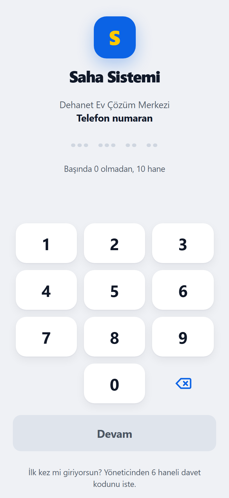 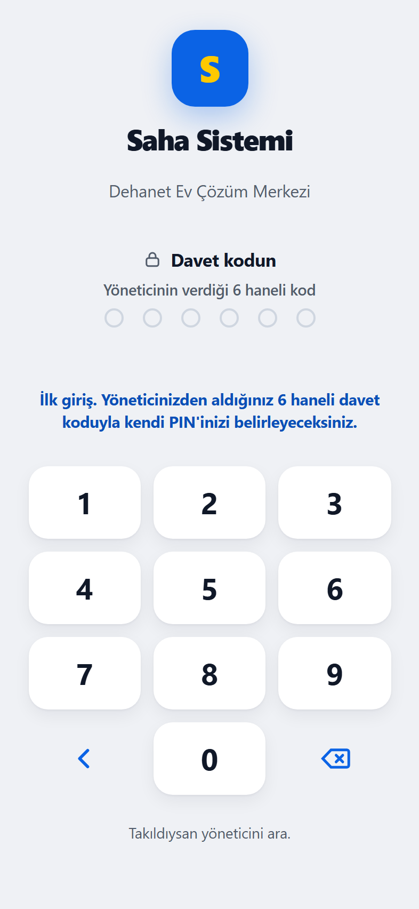

1. **Telefon numaranızı** yazın — başında 0 olmadan, 10 hane.
2. **Devam**'a basın.
3. İlk girişte **davet kodunuz** istenir. Yöneticinin verdiği **6 haneli kodu**
   girin.
4. Kendinize **4 haneli bir PIN** seçin, sonra aynısını bir daha girin.

Bu kadar. Bundan sonra her açılışta sadece PIN sorulur — çoğu zaman o bile
sorulmaz, uygulama sizi 30 gün hatırlar.

> **PIN'imi unuttum:** Yöneticiye söyleyin. Yönetim ekranından "PIN sıfırla"
> deyince size yeni bir davet kodu çıkar; yukarıdaki adımları tekrarlarsınız.
>
> **5 kez yanlış PIN** girilirse hesap **15 dakika** kilitlenir. Bekleyin.

---

## 4. Günlük iş akışı

### Bugün ekranı — gideceğiniz binalar

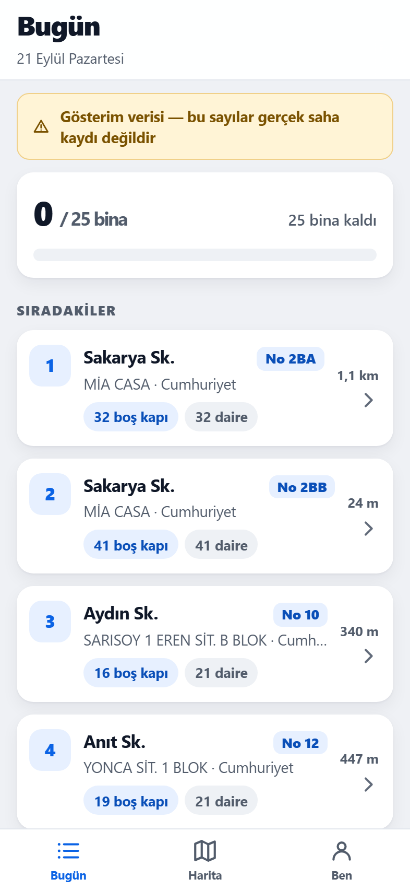

Sabah uygulamayı açtığınızda listeniz hazırdır. Binalar **en kısa yol sırasına
göre** dizilidir: 1'den başlayın, sırayla ilerleyin.

Her kartta:

- **Sıra numarası** (soldaki mavi kutu) — bitince yeşil tike döner
- **Bina adı** ve adresi
- **"54 boş kapı"** — bu binada kaç daire henüz abone değil. **Büyük sayı = büyük
  fırsat.**
- **"1 km" / "28 m"** — bir önceki binadan uzaklık

Üstteki çubuk günün durumu: **0 / 25 bina**. Bitirdikçe dolar.

Liste bittiğinde "**Liste bitti 🎉**" yazar ve isterseniz yeni bir tur
alabilirsiniz.

Listeniz yoksa "**Bugün için liste yok**" görürsünüz — yöneticiden liste
isteyin ya da "Liste oluştur" deyin.

### Bina ekranı

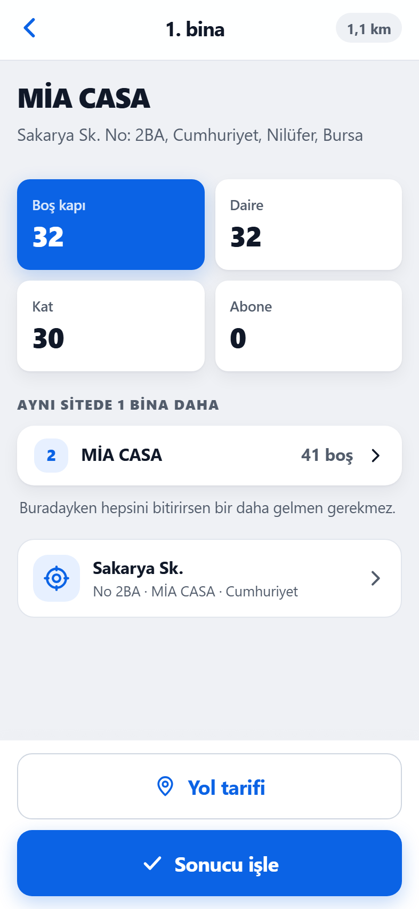

Karta bir kez dokunun. Bina ekranında kat/daire sayısı, boş kapı, mevcut abone
ve varsa geçmiş ziyaretler görünür. Altta iki büyük düğme:

- **Yol tarifi** → telefonun haritasında bina açılır (Google/Yandex/Apple)
- **Sonucu işle** → aşağıdaki ekran

### Sonucu işlemek

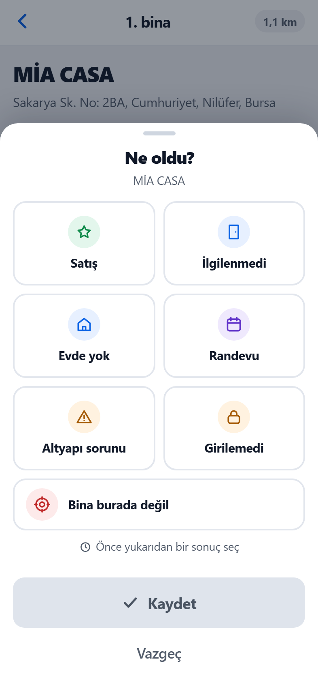

Binadan çıkınca **ne olduysa ona basın**:

| Düğme | Ne zaman | Sistem ne yapar |
|---|---|---|
| **Satış** | Abonelik aldınız | Kaç abonelik olduğunu sorar. Bina **yeşile** döner. |
| **İlgilenmedi** | Konuştunuz, istemediler | Bina kapanır, 30 gün listeye girmez. |
| **Evde yok** | Kimseyi bulamadınız | **7 gün sonra** tekrar listeye gelir. |
| **Randevu** | Sonra gelin dediler | Hangi gün geleceğinizi seçersiniz; o gün listenize düşer. |
| **Altyapı sorunu** | Fiber yok / hat sorunlu | Bina işaretlenir, boşuna bir daha gidilmez. |
| **Giremedim** | Kapıcı/yönetim almadı | Düşük öncelikle sonra tekrar denenir. |
| **Bu adres yanlış** | Bina orada değil / yıkılmış | Kayıt düzeltilmek üzere işaretlenir. |

İsterseniz **not** ve **hangi daire** bilgisi de ekleyebilirsiniz — ikisi de
zorunlu değil.

**Kaydet**'e bastığınız an iş biter: bina listeden düşer, sıradakine geçersiniz.

### Ben ekranı

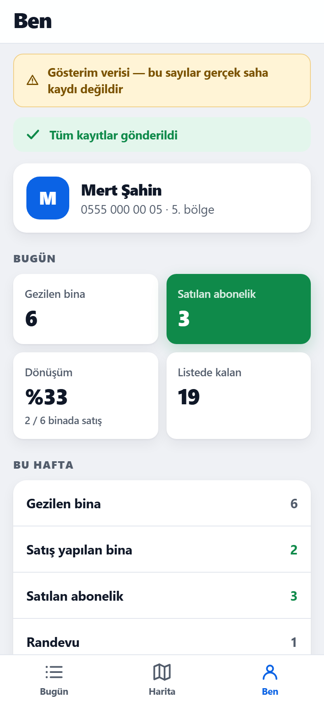

Bugün ve bu hafta kaç bina gezdiniz, kaç satış yaptınız, listede kaç bina kaldı.

### Harita

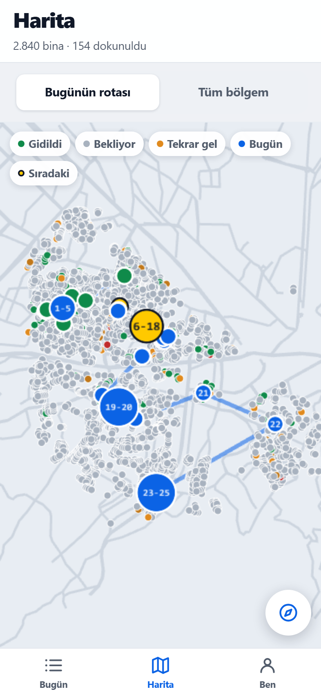

- **Yeşil** = gidildi · **Gri** = hiç gidilmedi · **Sarı** = tekrar gidilecek ·
  **Mavi** = bugünün listesi
- Mavi çizgi bugünkü rotanız.
- "**Tüm bölgem**" deyince bütün bölgenizi görürsünüz. Gri alanlar işinizin
  kalan kısmıdır.

Harita ağır bir ekrandır ve **ilk kez internetle açılmalıdır**. Sinyalsizken
hiç açılmamış bir haritaya dokunursanız uygulama çökmez; şunu görürsünüz ve
tek dokunuşla listenize dönersiniz:

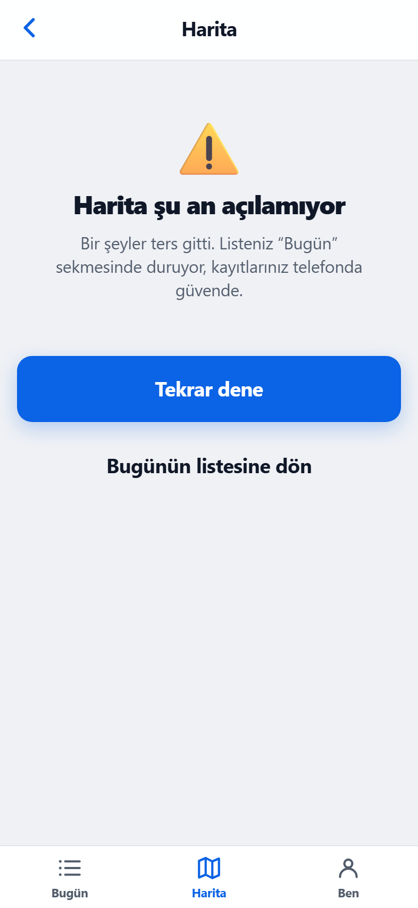

---

## 5. İnternet yoksa

**Hiçbir kaydınız kaybolmaz.** Bodrumda, asansörde, çekmeyen bir sitede
çalışmaya aynen devam edin.

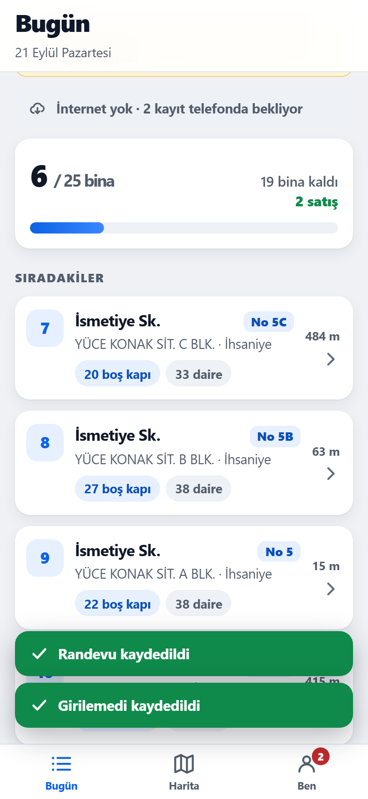 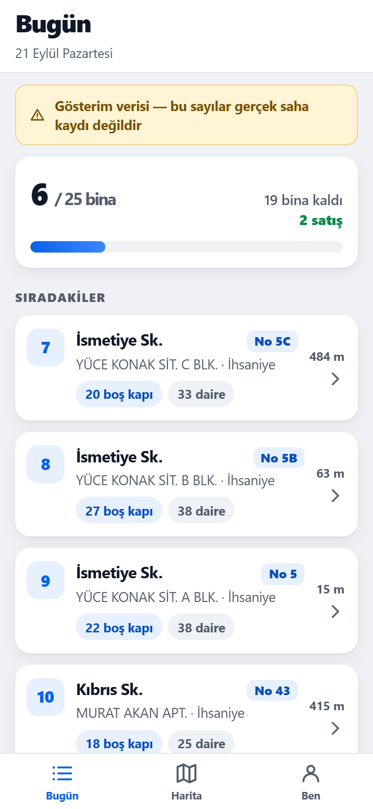

- Sinyal yokken ekranda **"İnternet yok — çalışmaya devam edebilirsiniz"** yazar.
- Kaydettiğiniz her sonuç telefonda saklanır: **"2 kayıt telefonda güvende"**.
- Sinyal gelince kayıtlar **kendiliğinden** gönderilir ve şerit
  **"Tüm kayıtlar gönderildi"** olur.
- Uygulamayı kapatıp açsanız, telefonu kapatsanız bile kayıtlar durur.

> Bekleyen kaydınız varken **çıkış yapmayın**. Uygulama zaten izin vermez.
>
> Şerit uzun süre "bekliyor" kalıyorsa: ofis wifi'sine bağlanın ya da şeritteki
> **"Şimdi gönder"**e basın.

---

## 6. Yönetici ekranı

Yönetici hesabıyla girdikten sonra alttaki **Yönetim** sekmesinden
(bilgisayarda doğrudan `#/yonetici` adresinden) açılır.

### Canlı durum

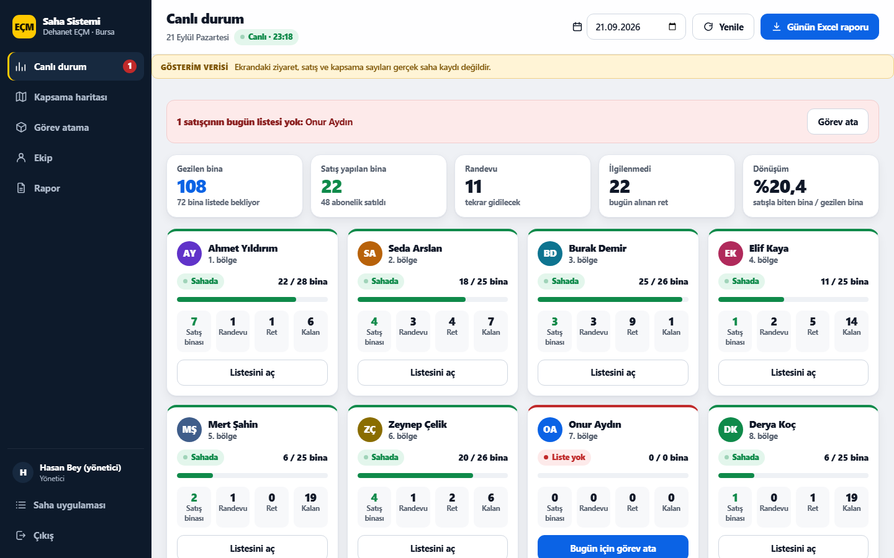

45 saniyede bir kendiliğinden tazelenir.

- Üstte günün beş rakamı: gezilen bina, satış, randevu, ret, dönüşüm.
- Altta 8 satışçı kartı: kim **sahada**, kim **henüz başlamamış**, kim
  **listesini bitirmiş**, kimin **listesi yok**.
- Sahaya çıkmamış olanlar en üstte kırmızı şeritte isimleriyle yazar.
- Karta tıklayınca o kişinin o günkü listesi açılır: hangi binaya gidildi,
  ne oldu, hangileri bekliyor.

### Kapsama haritası

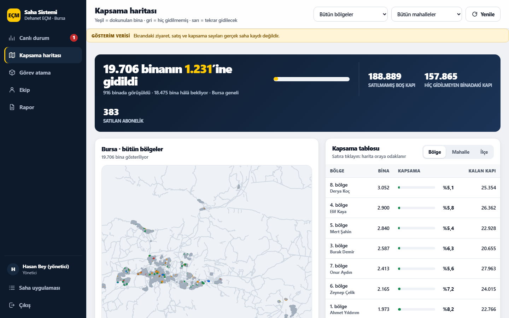

Tek cümlelik manşet: **"19.706 binanın 1.248'ine dokunuldu"**. Yanında kalan
boş kapı ve toplam satış.

Yeşil dokunuldu, gri bekliyor, sarı tekrar gel, kırmızı altyapı sorunlu.
Bölge ve mahalle ile süzebilir, sağdaki tablodan bölge/mahalle/ilçe kırılımını
görebilirsiniz.

**Boşluklar işin kalan kısmıdır.** Sudoku gibi: her gün biraz daha dolar.

### Görev atama

Üç adım: **kime → hangi binalar → ne zaman**.

Binaları üç yoldan seçebilirsiniz:

1. **Algoritma seçsin** — en yüksek potansiyelli binaları kendisi seçer ve
   ofisten başlayan bir tura dizer. Göndermeden önce listeyi ve kaç km olduğunu
   görürsünüz.
2. **Mahalleden seç** — bir mahallenin binaları.
3. **Haritadan çiz** — haritada bir dikdörtgen çizin; son 30 günde gezilmiş
   olanlar otomatik elenir.

**"Listeyi gönder"** dediğiniz an bina listesi satışçının telefonuna düşer —
kuryenin sistemine paket düşmesi gibi.

> Tur 25 km'yi geçerse sarı uyarı çıkar: o liste bir günde gezilemez,
> mahalleyle ya da haritayla daraltın.

### Ekip

Kişi ekleme, ad/telefon düzenleme, PIN sıfırlama, pasife alma.
Yeni kişi eklediğinizde ya da PIN sıfırladığınızda **davet kodu** büyük
puntoyla çıkar; o kodu kişiye verin.

#### Telefon kaybolursa / çalınırsa

Kayıp cihazdaki giriş 30 gün geçerlidir; hemen düşürülmesi gerekir.

1. **Ekip** ekranından kişiyi açın, **"Tüm cihazlardan çıkış yaptır"** deyin.
   Kayıp telefondaki oturum anında ölür. Kişinin PIN'i değişmez: yeni
   telefonundan kendi PIN'iyle hemen girer, sizden kod beklemez.
2. Telefon bir başkasının eline geçtiyse ayrıca **PIN sıfırlayın** — o zaman
   yeni bir davet kodu çıkar ve kişi yeni PIN belirler.
3. Kişi bir süre çalışmayacaksa **pasife alın**. Pasife almak da bütün
   cihazları düşürür; sonradan tekrar aktif edilse bile eski telefon giremez.

> Kayıp telefonda gönderilmemiş kayıt kalmış olabilir. O kayıtlar yalnız
> cihazda durur; ulaşılamazsa o binalar "gidilmemiş" görünür ve yeniden
> listeye girer — veri yanlış olmaz, sadece iş tekrarlanır.

### Rapor

Son 7 günün grafiği, bölge/mahalle/ilçe kapsama tablosu ve
**tarih seçip Excel indirme**.

### Operasyon ve Veri bölümleri (sol menünün altı)

| Menü | Ne işe yarar | Ayrıntı |
|---|---|---|
| **İş emirleri** | BOSS Teknik Task raporunu bırak → hazır Excel | ekrandaki adımlar; ya da dosyayı `canli\surum\operasyon\IS_EMRI_HAZIRLA.bat` üzerine sürükleyin |
| **Ticketlar** | OneDesk ticket defteri: durum güncelle, yeni ticket aç | §14 |
| **Bölge planlayıcı** | Satışçı sayısı değişince bölgeleri yeniden böl | §13 |
| **Tur raporu yükle** | Yeni `data.xlsx` gelince sayıları güncelle, yeni binaları haritaya al | §12 |
| **Veri kalitesi** | Sistemin kayıtlarda bulduğu tutarsızlıklar, bina bina | §15 |

Menüde "Ticketlar"ın yanındaki gri sayı **takipteki** (açık · hata · transfer) ticket
sayısıdır. Her binanın **Ayrıntılar** penceresinde (ve satışçının bina ekranında)
artık iki küçük bölüm daha var: **Veri notları** (o binanın kaydında bulunan
tutarsızlık, uyarılar üstte) ve **Ticket'lar** (kaç ticket var, son durumları,
**"Ticket aç"** düğmesi). Satışçı ticket kaydı açmaz; "Ticket aç" ona metni
kopyalatır, OneDesk'e ya da operasyona WhatsApp'tan yapıştırır.

> Bölgesi kalmayan (bölge planı küçülünce "bölgesiz" olan) satışçıya Görev atama
> ekranından liste gönderilemez; ekran bunu söyler ve Ekip ekranına yönlendirir.

---

## 7. Kapsama simülasyonu — algoritma tıkanıyor mu?

"Boşluklar dolacak" bir iddiadır; ölçülmesi gerekir. `saha/simulasyon.py` (kod: `kod/saha/simulasyon.py`)
19.706 gerçek binayı gerçek rota algoritmasıyla gezer ve sonucu sayıyla verir.
Veritabanına dokunmaz, geçici bir kopyada çalışır.

    .venv\Scripts\python.exe -m saha.simulasyon                 # 60 iş günü, 8 satışçı × 25 bina
    .venv\Scripts\python.exe -m saha.simulasyon --bitir 8       # 8. bölgeyi bitene kadar

**60 iş günü (yaklaşık 3 ay), 12.314 ziyaret:**

| Soru | Cevap |
|---|---|
| Kapsama her gün arttı mı? | Evet: 1. gün 208 bina → 60. gün **11.059 bina**, hiç duraklamadan |
| 30 günlük soğuma delindi mi? | Hayır — randevusu olmayan hiçbir binaya 30 gün dolmadan gidilmedi |
| Aynı kapı boşuna çalındı mı? | 12.314 ziyaretin 11.059'u **ilk kez** gidilen bina |
| Günlük tur gezilebilir mi? | Ortalama 17,4 km; turların %13'ü 25 km'yi aşıyor ve satışçı listeyi alırken uyarı görüyor |

Bölge bölge 60 gün sonunda: 1. bölge %70 · 2. bölge %76 · 3. bölge %55 ·
4. bölge %48 · 5. bölge %48 · 6. bölge %65 · 7. bölge %58 · 8. bölge %45.
(Küçük bölgeler daha hızlı dolar; 8. bölge 3.052 binayla en büyüğü.)

**Bir bölge tamamen ne kadar sürede gezilir?** 60 gün hiçbir bölgeyi bitirmeye
yetmez — en büyüğünde 3.052 bina var, günde 25 bina demek en iyi ihtimalle 122
gün demek. Bölge bitene kadar koşturulduğunda:

| Bölge | Bina | Her binaya uğranan gün | Fırsatı sıfır olan binalar |
|---|---|---|---|
| 1 | 1.973 | **87. iş günü** | 67'sinin hepsi girdi |
| 4 | 2.900 | **128. iş günü** | 50'sinin hepsi girdi |
| 8 | 3.052 | **134. iş günü** | 74'ünün hepsi girdi |

Yani bölgedeki HER binaya, teorik en iyi süreye **%10 yakın** bir sürede
uğranıyor; aradaki fark randevulara gidilen günler. Hiçbir binada 30 günlük
soğuma delinmiyor.

> **Bu tur sırasında bulunan ve düzeltilen gerçek hata.** Düzeltmeden önce
> 1. bölge 88 günde 1.972/1.973'e geliyor, kalan **tek bina** 350 iş günü daha
> listeye girmiyordu. Sebebi: dokunulmamış bina sayısı bir günlük işin altına
> düşünce havuz tekrar ziyaretlerle doluyor ve "fırsatı sıfır" ya da öbeğin
> dışında kalan son bina, yanındaki "30 günü dolmuş, 40 boş kapılı" binaya
> karşı hiçbir gün kazanamıyordu. Haritadaki son gri nokta tam da yöneticinin
> baktığı şey olduğu için bu önemliydi: artık kalan dokunulmamışlar **önce**
> alınıyor, günün geri kalanı tekrar ziyaretlerle doluyor. 442 gün → 87 gün.

Fırsatı sıfır olan 666 bina (boş kapısı kalmamış binalar) **60 günlük koşuda
listeye girmez** — bilerek en sonda beklerler. Sıraları bölgenin sonunda gelir;
yukarıdaki tabloda görüldüğü gibi hiçbiri unutulmaz. Kapsama tavanı %100'dür.

Simülasyon aynı tohumla her zaman aynı sonucu verir (`--tohum`), yani bu sayılar
tekrar üretilebilir.

---

## 8. Gösterim (demo) verisi

Sistem şu anda **gösterim verisiyle** doludur: 8 yer tutucu satışçı ve bir
haftalık uydurma ziyaret geçmişi. Amacı, sistemi ilk kez gösterirken ekranların
boş görünmemesi.

Her ekranda sarı bir şerit bunu yazar:
**"Gösterim verisi — bu sayılar gerçek saha kaydı değildir"**.

Gerçek kullanıma geçerken **tek komutla** silinir:

```
.venv\Scripts\python.exe -m saha.demo_temizle
```

Bu komut yalnızca uydurma kayıtları siler. Binalar, bölgeler, kullanıcı
hesapları ve varsa **gerçek saha kayıtları olduğu gibi kalır**.

Tekrar kurmak isterseniz: `.venv\Scripts\python.exe -m saha.demo`

---

## 9. Sahadan (ofis dışından) erişim

**Bugün sistem yalnızca ofis wifi'sinden çalışır.** Satışçı sahadayken mobil
veriyle bağlanamaz — kayıtlarını telefonda tutar ve ofise dönünce gönderir.
Bu, günlük çalışmayı engellemez (bkz. bölüm 5), ama yönetici o gün canlı
takip edemez.

Sahadan erişim için üç yol var. **Hiçbiri açık değildir**; açılması müşterinin
kararı ve BT onayı gerektirir, çünkü üçü de iç veriyi ofis ağının dışına taşır.

| Yol | Nasıl çalışır | Artı | Eksi |
|---|---|---|---|
| **Cloudflare Tunnel** | Ofis bilgisayarına küçük bir program kurulur, dışarıdan gelen bağlantıyı içeri taşır | Kurulumu en kolay, HTTPS hazır gelir (**"Ana Ekrana Ekle" ve çevrimdışı çalışma tam açılır**), sabit IP gerekmez | Trafik üçüncü bir firmanın ağından geçer — Turkcell BT onayı şart |
| **Şirket VPN** | Satışçının telefonuna kurum VPN'i kurulur, telefon ofis ağının içindeymiş gibi olur | Veri şirket ağından çıkmaz, en güvenlisi | Her telefona kurulum + VPN lisansı; satışçının her sabah VPN açması gerekir |
| **Sabit IP + port yönlendirme** | Ofis internetine sabit IP alınır, 8080 dışarı açılır | Ek yazılım yok | **Sunucu doğrudan internete açılır**; HTTPS sertifikası ve güvenlik duvarı kuralları şart, en riskli yol |

> **HTTPS notu:** "Ana Ekrana Ekle" ve çevrimdışı çalışmanın tam sürümü yalnız
> `https://` adreste açılır. Ofis içi `http://<ip>:8080` adresinde uygulama
> çalışır ama bazı telefonlar ana ekrana eklemeye izin vermeyebilir.
> Kalıcı çözüm istiyorsanız Cloudflare Tunnel ya da VPN + sertifika gerekir.

> ### ⚠ Ofis ağı dışına açmadan önce HTTPS ŞARTTIR
>
> Bugünkü bağlantı **şifresiz** (`http://`). Ofis wifi'sinde kabul edilebilir;
> internete açıldığı an kabul edilemez. Şifresiz bağlantıda aradaki herkes şunları
> düz metin okur:
>
> - **30 günlük giriş jetonu** — kopyalayan kişi o satışçının (ya da Hasan Bey'in)
>   yerine geçer, 30 gün boyunca bütün bina verisini görür ve kayıt girer.
> - **4 haneli PIN'ler ve 6 haneli davet kodları** — giriş anında ağdan geçer.
> - **19.706 binanın iç Turkcell verisi** ve çalışan telefon numaraları.
>
> Bu yüzden yukarıdaki üç yoldan hangisi seçilirse seçilsin, **önce HTTPS
> kurulmalı**, sonra dışarı açılmalıdır. Sertifikasız bir port yönlendirme
> (tablodaki üçüncü yol) tek başına yapılmamalıdır.
>
> Bu kurulumda hiçbir tünel açılmadı, hiçbir port dışarı yönlendirilmedi ve
> kendinden imzalı sertifika üretilmedi — karar ve uygulama BT'nindir.

---

## 10. Sorun giderme

| Belirti | Ne yapmalı |
|---|---|
| Telefonda sayfa açılmıyor | Telefon **ofis wifi'sinde** mi? Adres doğru mu? Ofis bilgisayarında sunucu penceresi açık mı? |
| "Oturum süresi doldu" | Tekrar PIN girin. 30 günde bir normaldir. |
| "5 kez yanlış" / kilit | 15 dakika bekleyin. |
| Kayıtlar "bekliyor"da takıldı | Şeritteki **"Tekrar dene"**ye basın. Sunucu kapalıysa açın. |
| Bina kartında "Bina" yazıyor | Bu binanın adı veride yok; adresten tanıyın, yöneticiye bildirin. |
| Harita açılmıyor | Ekranda "Harita şu an açılamıyor" yazar ve **Bugünün listesine dön** düğmesi çıkar. Harita ilk kez internetle açılmalıdır; listeniz ve kayıtlarınız etkilenmez. |
| Sunucu penceresinde hata | `canli\surum\saha\kayit\saha.log` dosyasını BT'ye gönderin. |
| Yönetici girince boş "Bugün" ekranı görüyor | Normaldir; alttaki **Yönetim** sekmesine geçin. |

---

## 11. Teknik özet (BT için)

- **Sunucu:** Python + FastAPI + SQLite (WAL), `canli\surum\saha\saha.db`, tek süreç.
  Hem API'yi hem telefon uygulamasını sunar.
- **Adres:** `0.0.0.0:8080` — yalnız yerel ağ. İnternete açık değil, tünel yok,
  dış servise veri gitmiyor.
- **Kimlik:** telefon + 4 haneli PIN (scrypt özeti), imzalı 30 günlük jeton.
  Anahtar `canli\surum\saha\gizli.key` (ilk çalıştırmada üretilir, sürüm kontrolünde değil).
  15 dakikada 5 hatalı denemede kilit.
- **Uygulama:** PWA (Vite + React + TypeScript), kaynak `kod\arayuz`, derlenmiş hâli `kod\arayuz\dist`.
  Harita deck.gl ile çizilir. Sokak/uydu altlığı açıldığında karolar telefonun
  tarayıcısından doğrudan karo sağlayıcısından gelir (varsayılan OpenStreetMap ve
  Esri; CSP yalnız bu iki sunucuya izin verir). Bina ve müşteri verisi gitmez (§16).
  Çevrimdışı kuyruk IndexedDB'de; gönderim `offline_id` ile idempotenttir.
- **Yedek:** `canli\surum\saha\yedek\` altına günlük, 30 gün.
- **Günlük:** `canli\surum\saha\kayit\saha.log`, 2 MB × 5 dosya dönüşümlü.
- **Veri modeli ve API sözleşmesi:** `belgeler\SAHA_SOZLESME.md`
- **Klasörler:** kod `kod\`, bina verisi `veri\`, çıktılar `cikti\`, çalışan sistem `canli\`;
  geliştirme sunucusu `kod\saha\GELISTIRME_BASLAT.bat` (yalnız `127.0.0.1:8090`,
  veri `gelistirme\veri\`). Bütün yollar tek dosyada: `kod\yollar.py`.

---

## 12. Yeni tur raporu gelince (ve yeni binaların konumu: OneMap aracı)

Superonline her ay yeni bir bina listesi (tur raporu, `data.xlsx`, **ORIGN** sayfası)
verir. Sistem bununla **güncellenir**: HP, abone ve boş kapı sayıları yenilenir,
listeden çıkan bina "pasif" olur, yeni binalar haritaya eklenir. **Bölgeler ve
ziyaret geçmişi değişmez.**

### Yönetim ekranından (önerilen)

**Yönetim → Veri → Tur raporu yükle.** Ekranın üstünde üç adım yazar:

1. **Raporu yükleyin.** `data.xlsx` dosyasını gri kutuya sürükleyin (ya da kutuya
   tıklayıp seçin). ~5 saniyede okunur. **Hiçbir şey değişmez.**
2. **Farka bakın.** Dört kutu: **yeni bina · rapordan çıkan · sayısı değişen · geri
   dönen**, altında toplamlar tablosu (**şimdi → uygulanınca → fark**) ve örnek
   binalar. Rapor sistemle aynıysa bunu tek cümleyle söyler. Sayılar mantıklıysa
   **"Uygula"** → onay penceresi ne olacağını madde madde yazar → **"Evet, uygula"**.
   Bugünkü binaların %10'undan fazlası raporda yoksa önce "Rapor tam, eksik değil"
   kutusunu işaretlemeniz istenir.
3. **Yeni binaların konumu (OneMap).** Konum bekleyen binalar listelenir; altında
   adım adım talimat ve düğmeler var: **bekleyen_idler.txt indir** → Brave'de OneMap
   adresi (**Adresi kopyala**) → F12 → Console → **Aracı kopyala**, yapıştır, Enter →
   kutudan `bekleyen_idler.txt` seç → inen **onemap_yeni.json**'u ekrandaki ikinci
   kutuya bırakın. Binalar haritaya ve bölgelerine girer; kaç binanın hangi bölgeye
   girdiği yazar.

Alttaki **Yüklenen raporlar** tablosunda her yükleme durur; satıra tıklayınca
önizlemesi yeniden açılır.

### Komut satırından (aynı sonuç)

Aşağıdaki komutlar ofis bilgisayarında, çalışan sürümün klasöründe
(bugün `DSALE\canli\surum`) açılan komut isteminde çalıştırılır. Sunucu açıkken de güvenle çalışır.

#### 1. Önce bakın, sonra uygulayın

```
.venv\Scripts\python.exe -m saha.veri_araci tur C:\Users\<siz>\Downloads\data.xlsx
```

Ekranda şu özet çıkar ve **hiçbir şey değişmez**:

```
Tur raporu okundu: 19.742 bina (ORIGN sayfası) · kayıt no 3
  Yeni bina        : 41   (hizmet dışı il: 0)
  Rapordan çıkan   : 5    (pasife alınacak)
  Sayısı değişen   : 2.318
  bina             : 19.706 → 19.742
  res_hp           : 296.778 → 297.910
```

Sayılar mantıklıysa aynı komutu sonuna `--uygula` ekleyerek çalıştırın:

```
.venv\Scripts\python.exe -m saha.veri_araci tur C:\Users\<siz>\Downloads\data.xlsx --uygula
```

- Aynı raporu iki kez uygulamak bir şeyi iki kez yazmaz.
- Raporda bugünkü binaların **%10'undan fazlası yoksa** (yanlışlıkla tek ilçelik ya
  da yarım bir dosya yüklendiyse) sistem durur ve sorar. Rapor gerçekten tamsa
  `--pasif-onay` ekleyin.
- Eski bir raporu yenisinden sonra uygulamak engellenir (veriler geriye gitmesin).
- Yüklenen her dosya `canli\surum\data\raw\gelen\tur_<tarih_saat>.xlsx` olarak saklanır.
- Her binanın neyinin, ne zaman, hangi rapordan değiştiği kayıtlıdır
  (bina ayrıntısında "değişiklik geçmişi").

#### 2. Yeni binaların konumunu OneMap'ten alın

Tur raporundaki yeni binaların koordinatı yoktur; konum OneMap'ten gelir.

1. Konum bekleyen binaların listesini alın:

   ```
   .venv\Scripts\python.exe -m saha.veri_araci bekleyen
   ```

   Komutu çalıştırdığınız klasörde `bekleyen_idler.txt` oluşur (her satırda bir kimlik).
2. **Brave**'i açın (OneMap oturumunuz açık olmalı) ve şu adrese gidin:
   `https://arcgis.turkcell.com.tr/arcgis/rest/services/ONEMAP/BINA/MapServer/0`
3. **F12** → **Console** (Konsol) sekmesi.
4. `canli\surum\saha\araclar\onemap_cek.js` dosyasını Not Defteri ile açın, **tamamını**
   kopyalayın (Ctrl+A, Ctrl+C), konsola yapıştırın, **Enter**.
   Tarayıcı "yapıştırmaya izin ver" isterse `allow pasting` yazıp Enter'a basın.
5. Sağ üstte mavi çerçeveli bir kutu açılır. **bekleyen_idler.txt** dosyasını seçin.
6. İş bitince `onemap_yeni.json` İndirilenler klasörüne iner; kutuda kaç binanın
   bulunduğu yazar.
7. Dosyayı sisteme verin:

   ```
   .venv\Scripts\python.exe -m saha.veri_araci onemap C:\Users\<siz>\Downloads\onemap_yeni.json
   ```

   Yeni binalar haritaya eklenir: aynı sitenin binaları varsa onların bölgesine,
   yoksa en yakın binanın bölgesine verilir. Bina "bekliyor" durumunda başlar,
   ertesi günden itibaren satışçının listesine girebilir.

> **Araç ne yapar, ne yapmaz:** yalnız OneMap'e sorgu atar ve sonucu SİZİN
> bilgisayarınıza indirir. Şifre sormaz, oturum bilgisine dokunmaz, başka hiçbir
> yere veri göndermez. OneMap'te henüz olmayan binalar "bulunamadı" olarak sayılır;
> bir sonraki turda yeniden denenir.

---

## 13. Bölge planlayıcı — "8 ekipten 14 ekibe çıkınca"

Ekip büyüyünce ya da küçülünce bölgeler yeniden bölünür. Excel'de günler süren iş
burada üç adımdır: **önizle → uygula → (gerekirse) geri al.**

**Yönetim → Veri → Bölge planlayıcı:**

1. Üstte **bugün**: kaç bölge, kaç satışçı, kaç bina; altta her bölgenin kartı
   (satışçısı, bina, RES HP, boş kapı, binaların ne kadarına dokunulduğu). Karta
   tıklayınca harita o bölgeye yaklaşır.
2. **"Kaç satışçıyla çalışacaksınız?"** — `−` / `+` ya da kaydıraçla sayıyı seçin
   (kaydıraçta **bugün** işareti durur) → **"14 bölgeyi önizle"**. Harita yeni
   bölgelerle boyanır; üstte tek cümle: *"9.171 bina başka satışçıya geçer, geçmiş
   ziyaretler korunur."* Altında bölge başına sayılar tablosu ve binaların hangi
   eski bölgeden geldiği. Hazır planı olmayan sayıda ilerleme çubuğu çıkar; bitince
   önizleme kendiliğinden açılır (sayfadan çıkabilirsiniz, hesap sunucuda sürer).
3. **"Uygula"** → onay penceresi → **"Evet, 14 bölgeyi uygula"**. Yeni bölgelerin
   davet kodları hemen ekrana gelir (kodun üstüne basınca kopyalanır).
4. Sağ üstte **"Geri al"** (bir önceki plana döner) ve **"Excel indir"**
   (`Bursa_14_Satisci_Bolgeleme.xlsx`). Altta plan geçmişi: hiçbir plan silinmez.

Komut satırından aynısı:

```
.venv\Scripts\python.exe -m saha.veri_araci bolge            # bugünkü bölgeler
.venv\Scripts\python.exe -m saha.veri_araci bolge 14         # 14 bölgelik ÖNİZLEME (hiçbir şey değişmez)
.venv\Scripts\python.exe -m saha.veri_araci bolge 14 --uygula
.venv\Scripts\python.exe -m saha.veri_araci bolge --geri-al  # bir önceki plana dön
.venv\Scripts\python.exe -m saha.veri_araci excel            # planın açıklayıcı Excel'i
```

Önizleme her bölgenin bina, RES HP ve fırsat sayısını, satışçısını ve **kaç binanın
el değiştireceğini** gösterir. 2-30, 35, 40, 45, 50 bölgelik planlar hazırdır (anında
açılır); başka bir sayı ya da güncel veriyle yeniden hesap istenirse sistem arka
planda hesaplar (N'e göre 10 saniye - 2 dakika).

Uygulayınca:

- **1-8. bölgeler numarasını ve satışçısını korur**, 9-14 yeni açılır. Her yeni
  bölge için bir **yer tutucu satışçı hesabı** ve **davet kodu** çıkar: Ekip
  ekranından ad ve telefonu düzeltip kodu kişiye verin.
- Ziyaret geçmişi, bugünkü listeler ve satışlar **olduğu gibi kalır**. Bölgesi
  değişen bir binaya bugün listesinde olan satışçı yine gidebilir; kaydı reddedilmez.
- Planı **akşam** uygulamak en temizidir (önizleme, bugünkü listelerde kaç binanın el
  değiştireceğini ayrıca söyler).
- Bölge sayısı azalırsa (14 → 8) bölgesi kalmayan satışçı **"bölgesiz"** olur (hesabı
  açık, hiçbir binaya dokunamaz). Pasife almak isterseniz `--pasiflestir` ekleyin.
  **Hiçbir hesap silinmez.**
- **Geri al** bir önceki plana döner: binalar ve satışçılar eski bölgelerine, yeni
  açılan yer tutucu hesaplar kapanır (silinmez).
- Excel (`Bursa_14_Satisci_Bolgeleme.xlsx`) güncel sayılarla ve satışçı adları dolu
  olarak üretilir; ilk seferde yarım dakika sürer.

> `python -m saha.kur` yeniden çalıştırılsa da planlayıcıyla yapılmış bölgeler ve
> tur raporuyla gelmiş sayılar geri dönmez.

---

## 14. Ticket defteri (Excel'deki TICKET sayfasının yerine)

Sinyal zayıf / ek kapasite / güzergah / altyapı ticket'ları artık binaya bağlı bir
defterde tutulur. Her ticket'ın açılış tarihi, OneDesk numarası, durumu (AÇIK ·
ÇÖZÜLDÜ · HATA · KAPATILDI · İPTAL · TRANSFER), müşteri numaraları ve kanalı durur;
her durum değişikliği **notuyla birlikte** geçmişe yazılır ve bina kartında görünür.

**Ticket metni** tek tuşla üretilir ve kopyalanır; sizin OneDesk'e yazdığınız metinle
harfi harfine aynıdır (sekme ayrımlı, Excel'e yapıştırınca her değer kendi hücresine
düşer):

```
*BTK ÇAĞRISI ACİL MÜDAHALE* Merhaba, … rica ederim.  Bina Serial Number  BN-0000362608
Tellcordia ID  16014745208    Location Id  O25265408    Obek Adı  BRS-ATAEVLER
Site Adı  MERSA SİT. D BLK. MERSA D  Ekip: +905551234567
```

Location Id'si Excel'de sıfırlarını kaybetmiş binalarda (2.335 bina) metne BOSS'taki
doğru hâli (`00113680`) yazılır.

### Yönetim ekranından

**Yönetim → Operasyon → Ticketlar.**

- Üstte tek cümle: **kaç ticket takipte**, en eskisi kaç gündür açık; sağda iki
  kutu: **HATA** verenler ve **OneDesk numarası yazılmamış** açıklar (kutuya basınca
  liste onlara süzülür).
- **Durum çipleri** (Hepsi · Takipte · Açık · Hata · Transfer · Çözüldü · Kapatıldı ·
  İptal) sayılarıyla; altında **arama** (ticket no, Location Id, site, müşteri, BN) ve
  **konu · kanal · tarih · bölge** süzgeçleri. "Listeyi kopyala (Excel)" görünen
  listeyi Excel'e yapıştırılacak biçimde kopyalar.
- Satıra tıklayınca sağdan ayrıntı açılır. **Mail gelince:** "Durum güncelle"den yeni
  durumu seçin (Çözüldü, Transfer…), isterseniz not yazın → **"Durumu … yap"**. Her
  değişiklik notuyla **Geçmiş**e yazılır. Numarası olmayan ticket'ta en üstte OneDesk
  numarası kutusu çıkar. "Binayı aç" binanın Ayrıntılar penceresini açar.
- **Yeni ticket** (sağ üstte ya da bir binanın Ayrıntılar penceresinde **"Ticket
  aç"**): bina hazır gelir (sağ üstten açılınca ad, Bina Serial ya da Location Id ile
  aranır) → konu → ekip telefonu → **"Metni kopyala"** → OneDesk'te ticket'ı açın →
  numarasını **2. kutuya** yazın → **Kaydet**. Numara henüz yoksa "Numarasız kaydet"
  deyin; defterde "numara yok" olarak durur, sonra eklenir. Binada aynı konuda açık
  ticket varsa pencere en üstte uyarır.

### Mevcut Excel kayıtlarını bir kez aktarmak

```
.venv\Scripts\python.exe -m saha.ticket_aktar --kuru     # önce ne olacağını görün
.venv\Scripts\python.exe -m saha.ticket_aktar            # aktarın
```

Varsayılan dosya `GitHub\PS26\data.xlsx` (DSALE'nin yanındaki PS26 klasörü; yoksa `--dosya` ile verin), sayfa `TICKET`. Komutu istediğiniz kadar
çalıştırabilirsiniz: yeni satırlar eklenir, **hiçbir ticket iki kez yazılmaz**.
Excel'i bir süre daha kullanırsanız, Excel'de sonradan yazdığınız OneDesk numarası
ve durum da ticket'a işlenir — ama uygulamada elle değiştirdiğiniz ticket'a Excel
dokunmaz. Lokasyonu `00145672` ya da `O27592861-1` gibi yazılmış satırlar da doğru
binaya bağlanır.

> **Not:** Bu aktarım canlı veritabanında henüz çalıştırılmadı. Sunucu yeni
> sürümle bir kez açıldıktan sonra yukarıdaki komutu çalıştırın.

Maille gelen "çözüldü / transfer" bildiriminin ticket'ı kendiliğinden güncellemesi
bir sonraki adımdır (GEREKSINIMLER C11).

---

## 15. Veri kalitesi — mantıksız veriyi mantıklıya çevirmek

Sistem her binayı 14 açık kuralla denetler ve bulduğunu sade Türkçe yazar
(bina kartında "Veri notları"). Örnekler:

| Ne bulundu | Kaç bina | Ne yapıldı |
|---|---|---|
| Location Id'nin baştaki sıfırları Excel'de düşmüş (113680 → 00113680) | 2.335 | OneMap ile doğrulanıp düzeltildi |
| Tellcordia ID bilimsel sayıya dönmüş (1,61623150353E+011) | 2 | Doğru hâli yazıldı |
| Aktif abone RES HP'den fazla | 303 | Boş kapı 0 sayıldı, işaretlendi (HP'ye dokunulmaz) |
| 1 katlı binada 38 daire | 91 | Haritada tahmini kat gösteriliyor |
| Kat sayısı OneMap'te yok | 9.835 | Daire sayısından tahmin edildi |
| Bina adı "Null" | 7 | Boş sayıldı, kartta site adı çıkıyor |

**Satışı etkileyen sayılara (RES HP, abone) hiçbir zaman dokunulmaz**; yalnız
kesin olan ya da yalnız görüntüyü etkileyen değerler düzeltilir. Düzeltilen her
değerin orijinali saklanır.

**Yönetim → Veri → Veri kalitesi:** her kural bir kart. Kartın üstündeki etiket
tek şeyi söyler: **Kontrol edilmeli** (turuncu — kaynağında ya da sahada bakılmalı),
**Sistem düzeltti** (yeşil), **Bilgi** (gri) ya da **Sorun yok**. Karta tıklayınca
sağda "Ne demek? / Sistem ne yaptı?" ve o binaların listesi açılır (düzeltilenlerde
"eski → yeni" yazar); binaya tıklayınca Ayrıntılar penceresi. "Listeyi kopyala
(Excel)" bütün listeyi kopyalar. Üstten bölge seçilebilir; **"Yeniden denetle"**
kurallar ya da kaynak dosyalar değişince kullanılır.

```
.venv\Scripts\python.exe -m saha.veri_araci kalite       # kural başına özet
```

---

## 16. Harita altlığı (sokak ve uydu görüntüsü)

Yakınlaştırınca haritanın altında sokaklar ve uydu görüntüsü görünür. Varsayılan:

- **Sokak:** OpenStreetMap (© OpenStreetMap katkıcıları)
- **Uydu:** Esri World Imagery

> **Lisans:** OpenStreetMap karoları yalnız hafif kullanım içindir ve atıf her zaman
> görünmelidir; toplu indirme yasaktır. Esri uydu görüntüsünün ticari kullanımı ArcGIS
> lisansı ister. Kalıcı kullanım için lisanslı bir sağlayıcı (MapTiler, Mapbox, HERE)
> ya da Turkcell'in kendi altlığı bağlanmalıdır: yönetici ayarından yalnız adres
> değiştirilir, başka hiçbir şeye dokunulmaz. Karo istekleri telefondan sağlayıcıya
> gider; **bina ve müşteri verisi gitmez**.
