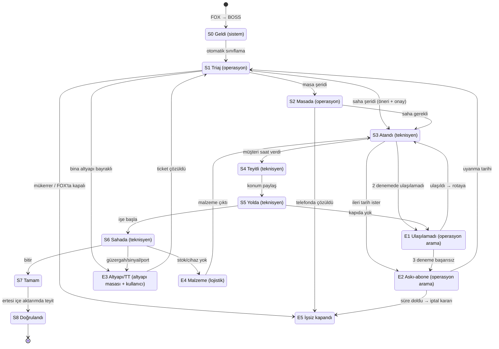

# Operasyon süreci: her iş emri 24 saatte biter

**Dehanet EÇM (Bursa + Yalova) · Satış · Teknik · Operasyon**
Anlık görüntü: 29.09.2026 ~17:00 (BOSS açık task raporu + FOX açık + FOX askı dışa aktarımları).

> Bu belgedeki bütün sayılar toplulaştırılmıştır. İçinde müşteri adı, adres, telefon, müşteri no ya da
> task no yoktur. Sayıları yeniden üretmek için:
> ```
> .venv/Scripts/python.exe operasyon/analiz/surec_analiz.py     # → cikti/surec_veri.json
> .venv/Scripts/python.exe operasyon/analiz/surec_parametre.py  # → cikti/surec_parametre.json
> ```
> Durum makinesi, zaman bütçeleri ve rol→ekran listesi `surec_parametre.py` içinde tek yerde tutulur.
> Belge ile o dosya çelişirse dosya doğrudur, belge ona göre düzeltilir.

---

## 0. Kısaca

1. **Sorun iş emirlerinin aktarımında değil, bayinin içinde.** FOX'tan BOSS'a geçiş medyan 7 saniye.
   Gecikme atama, temas ve kapanış aşamalarında birikiyor: 1.905 açık işte ekip atanmamış, 362 randevunun
   saati geçmiş ama iş hâlâ açık, "konum paylaşıldı/başlandı" durumundaki 134 işin 69'u 12 saatten uzun süredir kapanmamış.
2. **Birikimin yarısı teknisyen göndererek çözülmez.** 24 saati geçmiş 2.124 işin 1.042'si askı, ulaşılamadı,
   altyapı (TT/güzergah/sinyal/port), masa işi, lojistik ya da sahada kapatılmamış kayıt. Kalan 1.082'si gerçek
   saha işi ve bunların 743'ü hiç ekibe atanmamış.
3. **Her işe tek bir 24 saatlik saat yetmez.** Turkcell'in FOX'taki hedefleri daha sıkı: TV arıza 6 saat,
   bağlantı ve arama problemi 12 saat, BTK/Mahkeme şikayeti 4 saat. Bu yüzden iş beş şeride ayrılır:
   **BTK · Cihaz · Masa · Lojistik · Kurulum**. Her şeridin kendi saati, sahibi ve temas kuralı vardır.
4. **Temas politikası: doğrudan ata, teknisyen sabah rotayı kurarken arasın, operasyon yalnız istisnaları
   arasın.** Kullanıcının önerisi zaten çekirdekte; buna dört şey eklenir: BTK'da paralel uzaktan ön-teşhis,
   altyapı ön kontrolü (gidilse de çözülmeyecek işi sahaya göndermemek), 3 denemeli ulaşılamadı protokolü,
   segment bazında ölçüp politikayı değiştirme (§3).
5. **Kesim saatleri 24 saati somutlaştırır.** 12:00'ye kadar gelen iş aynı gün, 12:00–17:00 arası gelen iş
   ertesi gün öğlene kadar, 17:00'den sonra gelen iş ertesi gün 17:00'ye kadar biter. Tepe akşam varışları için
   teknisyenlerin ~%15'i 11:00–21:00 kaydırmalı vardiyada çalışır.
6. **Tek uygulama, üç birim.** Açılışta "Satış · Teknik · Operasyon" sorulur. Giriş, oturum, çevrimdışı kuyruk,
   harita ve bina kartı mevcut saha uygulamasından alınır. Yeni olanlar: iş emri modeli, BOSS/FOX içe aktarımı,
   atama panosu, teknisyen iş listesi, operasyon kuyrukları, talep (WhatsApp/mail/satış) kaydı, KPI panosu.
7. **Kurtarma, günlük akıştan ayrı yürür.** Önce yeni gelen işin 24 saati korunur ("önce musluğu kapat").
   Birikim kendi kapasitesiyle erir: masa ekibi, geçici ek teknisyen ve pazar mesaisi. Sıra: en eski BTK
   işleri, sonra coğrafi kümeler halinde en eskiden yeniye. Hedef: 4 haftada 24 saati geçen iş sayısını
   100'ün altına indirmek (§7).

---

## 1. Veri ne söylüyor

| Konu | Sayı |
|---|---|
| BOSS açık task | **2.567** (Açık 1.669 · Askıya alındı 413 · Merkeze gönderildi 351 · Konum Paylaşıldı 70 · Başlandı 64) |
| FOX açık / askı | 2.094 / 523 |
| Eşleşme | BOSS'taki işlerin 2.561'i FOX'ta da var. Yalnız FOX'ta 56, yalnız BOSS'ta 6 iş var. **FOX'ta askıda olup BOSS'ta aktif görünen 78 iş var** (durum uyumsuzluğu). |
| FOX → BOSS aktarımı | medyan 7 sn, p90 1 dk'nın altında: **sorun aktarımda değil** |
| 24 saati geçmiş | **2.124 (%83)** |
| Yaş kovası | <24 s 443 · 24–48 s 274 · 48–72 s 254 · 3–7 g 608 · 7–30 g 811 · >30 g 177 (en eski açık iş 24.05.2026) |
| Grup | **Mevcut müşteri 953** (703'ü >24 s) · Yeni kurulum 1.614 (1.421'i >24 s) |
| Şerit (mevcut müşteri) | BTK 314 (168'i >24 s) · Lojistik 243 · Masa 203 · Cihaz 193 |
| Turkcell hedefi (FOX "Hedef SL") | BTK/Mahkeme 4 s · TV arıza 6 s · Bağlantı 12 s · Arama 12 s · Arıza bildirim, Kanal şikayeti, Cihaz iade 24 s · Cihaz geri alım 48 s · BTK şikayet 168 s · kurulumlar ve cihaz değişiklikleri için FOX'ta hedef tanımlı değil (0) |
| Turkcell hedefini aşan | Hedefi tanımlı 712 işin **566'sı** (6 s hedefli: 51/58 · 12 s: 171/235 · 24 s: 341/414) |
| Atama | **1.905 işte ekip boş** (1.135 Açık + 413 askı + 351 merkeze + 6). Açık işi olan 37 ekip var. Ekip başına medyan 13 iş, en yüklü ekipte 66. |
| Randevu | 648 randevulu. **362'sinin randevu saati geçmiş ama iş açık.** Pencereler hep 2 saatlik ve 216'sı 11:00'de (varsayılan slot gibi duruyor). BTK işlerinde randevu, iş açıldıktan medyan 3,1 saat sonra. |
| Saha adımı | 182 işte konum paylaşılmış, 173'te işe başlanmış. Şu an "Konum Paylaşıldı/Başlandı" durumunda 134 iş var; **bunların 69'u 12 saatten uzun süredir bu durumda.** (İşe başlanmış olup başka duruma geçen 68 iş merkeze gönderilmiş.) BOSS'ta son işlemin Web/Mobil kırılımı: WEB 51, MOBİL 2. |
| Merkeze gönderildi (351) | ABONEYE ULAŞILAMADI 243 · GÜZERGAH YOK 21 · SİNYAL YOK 19 · TASK GEÇ DÜŞTÜ 15 · CİHAZ KAYIP 14 · BOŞ PORT YOK 12 · boş 27 |
| Askıya alındı (413) | Abone kaynaklı 251 (158'i Kanal Şikayeti) · TT kaynaklı 160 (hepsi "Kurulum ve Cihaz Gönderim" + Nakil/Geçiş, FOX ürünü çoğunlukla DSL; 159 açıklama "TT etiketleme yapılmamış") |
| FOX askı sahipliği | 523 askının **295'i kullanıcının kendi üzerinde**, kalanı 4 kişide |
| Son açıklama | 648 işte "ulaşılamadı / cevapsız", 302'sinde "ekibe iletildi", 159'unda "TT etiketleme", 1.165'i boş |
| Varış saati (son 7 gün, hâlâ açık olanlar) | 00–08 %2 · 08–12 %24 · 12–17 %46 · 17–20 %19 · 20–24 %9. **BTK'da 17:00 sonrası pay %32.** |
| Günlük giriş | Pazartesi 28.09 açılıp hâlâ açık: 350. Salı 29.09, 17:00'ye kadar: 310. Bu sayılar alt sınır, çünkü o gün kapananlar görünmez. Kullanıcının tahmini 250–300. **Tasarım günde 300 iş ve Pzt–Salı 350 tepe için boyutlandırıldı.** Son iki günde mevcut müşteri payı ~%50; BTK günde ~90 (bağlantı 63–66, TV arıza 15–20, doping 8–10). |
| Lokasyon | 1.516 işte Lokasyon dolu ve bunların 1.328'i (%88) bina ana tablosuyla eşleşiyor. **1.051 işte (%41) Lokasyon boş**: harita ve rota için adres eşlemesi gerekiyor. |
| Takip dosyası (data.xlsx) | TICKET 197 (SİNYAL 132 · EK SP 65). Durum: ÇÖZÜLDÜ 128 · HATA 32 · AÇIK 26 · KAPATILDI 9 · İPTAL 2. **EK SP taleplerinin 30/65'i "HATA"da.** Açık ticket'ların medyan yaşı 22 gün. GÜZERGAH: 64 kayıt / 60 lokasyon. ALTYAPI: 67 satış kaydı (29.07–28.09). |

**Sonuç:** Gecikme tek bir yerde değil, iş el değiştirdiği her noktada birikiyor. Atama bir kişinin elle yapmasına
bağlı. Müşteriye ulaşılamayınca iş bir sonraki kişiye gidiyor ama saati kimse tutmuyor. Askı bir kez açılınca
kendiliğinden bitmiyor. Sahada biten iş BOSS'ta kapanmıyor. Süreç tasarımının amacı, her durumun **bir sahibi, bir süresi ve
süre dolunca otomatik bir sonraki adımı** olmasını sağlamak.

---

## 2. Bir iş emrinin hayatı

### 2.1 Sınıflama: grup ve şerit

**Grup** (kullanıcının kuralı): Task adında "kurulum" geçiyorsa **YENİ**. Bunun istisnası "Kurulum Taskı
Ürememiş"tir. Adında kurulum geçmeyen her iş **MEVCUT** müşteri işidir ve kullanıcıya düşer.
FOX ile BOSS adları farklıdır. Sınıflama **BOSS adına** göre yapılır, çünkü atama BOSS'ta olur:

| BOSS adı | FOX adı | Grup | Şerit |
|---|---|---|---|
| Bağlantı Problemi | Bağlantı Problemleri | Mevcut | **BTK** |
| TV+ Arıza | IP TV Arıza | Mevcut | **BTK** |
| Arama Problemi | Arama Problemi | Mevcut | **BTK** |
| Doping Arıza Bildirimi | Arıza Bildirim | Mevcut | **BTK** |
| (yalnız FOX) | BTK Şikayet · BTK / Mahkeme Şikayet | Mevcut | **BTK** |
| 2.Donanım | İkinci Donanım Kurulum | Mevcut* | Cihaz |
| Modem / Superbox Modem / STB Cihaz Değişikliği | aynı | Mevcut | Cihaz |
| Kanal Şikayeti · Teknik Servis Ücretlendirme | Kanal Şikayeti · Ücretlendirilecek Servisler | Mevcut | Masa |
| Cihaz İade Bekleniyor · Cihaz Geri Alım · Turksat İade · Evrak Toplama | aynı | Mevcut | Lojistik |
| TV+ Kurulum (+Nakil/Geçiş) | IP TV Kurulum | Yeni | Kurulum |
| Fiber Kurulum (+Dönüşüm/Nakil/Geçiş) | Quiknet Kurulum Talebi | Yeni | Kurulum |
| Superbox Kurulum · TT Fiber Kurulum · Kurulum ve Cihaz Gönderim · Yan Oda Kurulum | SuperBox Kurulum · TT Fiber Kurulum Talebi · Kurulum ve cihaz gönderim · TV Yan Oda Kurulum | Yeni | Kurulum |

\* FOX adında "Kurulum" geçtiği halde BOSS adında geçmiyor. Belge BOSS adını esas aldı; bkz. açık sorular.

**Öncelik** şerit içinde **kalan süreye** göre belirlenir: `kalan = hedef − yaş`. Hedef, Turkcell hedefi ile 24 saatten
küçük olanıdır. Kalan süresi en az olan iş önce gelir; bu yönteme en erken son tarih önce (EDF) denir.

### 2.2 Durum makinesi



| Kod | Durum | Sahibi | BOSS'ta görünüşü | FOX'ta | Çıkış |
|---|---|---|---|---|---|
| S0 | Geldi | Sistem | Açık, ekip boş | *KUYRUKTA | Otomatik sınıflama: grup, şerit, hedef ve altyapı ön kontrolü |
| S1 | Triaj | Operasyon triaj/atama masası | Açık, ekip boş | *KUYRUKTA | S2 · S3 · E3 · E5 |
| S2 | Masada | Operasyon arama masası | Açık | *KUYRUKTA | E5 (telefonda çözüldü) · S3 · E1 |
| S3 | Atandı | Teknisyen | Açık, ekip dolu | *ATANDI | S4 · E1 · E2 |
| S4 | Teyitli | Teknisyen | Randevulu (2 saatlik pencere) | *ATANDI | S5 |
| S5 | Yolda | Teknisyen | Konum Paylaşıldı | *ATANDI | S6 · E1 |
| S6 | Sahada | Teknisyen | Başlandı | *ATANDI | S7 · E3 · E4 · E2 |
| S7 | Tamam | Teknisyen → sistem | Bitirildi (açık rapordan düşer) | kapalı | S8 · E6 |
| S8 | Doğrulandı | Operasyon (veri) | açık listede yok | açık/askı listesinde yok | son |
| E1 | Ulaşılamadı | Operasyon arama masası | Merkeze gönderildi: ABONEYE ULAŞILAMADI | *KUYRUKTA | S3 · E2 |
| E2 | Askı: abone kaynaklı | Operasyon arama masası | Askıya alındı: Abone kaynaklı | ASKIDA | S1 (uyanma) · E5 (süre doldu) |
| E3 | Altyapı / TT | Altyapı masası (OneDesk ticket'ını kullanıcı açar) | Askı: TT kaynaklı · Merkeze: GÜZERGAH/SİNYAL/BOŞ PORT | ASKIDA | S1 (ticket çözüldü) |
| E4 | Malzeme | Lojistik masası | Açık (stok/depo açıklaması) | *ATANDI | S3 |
| E5 | İşsiz kapandı | Operasyon | kapalı | kapalı | son, neden kodu zorunlu |
| E6 | Tekrar arıza | Mevcut müşteri sorumlusu | yeni task | yeni akış | kıdemli teknisyene atanır; ilk seferde çözüme sayılmaz |

**Kural:** BOSS resmî kayıttır; Turkcell BOSS'u ve FOX'u görür. Uygulama BOSS'un yerine geçmez. Uygulama BOSS'un
tutmadığı şeyleri tutar: temas sonucu, uyanma tarihi, ticket bağlantısı, sorumlu kişi ve durumdaki süre.
BOSS'taki durum her içe aktarımda okunur. Uygulamadaki durum BOSS'la çelişirse iş "uyumsuzluk" listesine düşer.

### 2.3 Zaman bütçeleri

**Kesim saatleri** 24 saati sahada uygulanabilir bir kurala çevirir:

| İşin geldiği saat | Bitmesi gereken zaman | Son 7 günde gelen işlerin payı |
|---|---|---|
| 00:00–12:00 | **aynı gün** (akşam rotası dahil) | %26 |
| 12:00–17:00 | **ertesi gün 12:00'ye kadar** (sabah rotasının ilk yarısı) | %46 |
| 17:00–24:00 | **ertesi gün 17:00'ye kadar** | %28 |

Bu kuralla her iş en geç 24 saatte biter. Rota kurulurken kesim saatine göre son tarih (deadline) atanır.

**Standart şerit (Cihaz · Masa · Lojistik · Kurulum), 24 saat = 1.440 dk:**

| Durum | Bütçe | Not |
|---|---|---|
| S0 Geldi | 5 dk | otomatik |
| S1 Triaj | 30 dk | 08:00–21:00 arası. Gece gelen iş 08:00'de ilk parti olarak triajdan geçer. |
| S3 Atandı → temas | 2 saat | Teknisyen, rotasına eklenen işi 2 saat içinde arar. Ertesi güne kalan işi sabah 08:00–08:45 arasında arar. |
| S4 Teyitli (rotada bekleme, gece dahil) | 18 saat | Kesim saati kuralı bu sürenin içinde kalır. |
| S5 Yolda | 1 saat | |
| S6 Sahada | 2 saat | |
| S7 Kapanış | 25 dk | BOSS'ta "bitir" |
| **Toplam** | **1.440 dk** | |

**BTK şeridi.** Bağlantı ve arama problemi 12 saat (720 dk), TV arıza 6 saat (360 dk):

| Durum | Bağlantı (12 s) | TV arıza (6 s) |
|---|---|---|
| S0 Geldi | 5 dk | 5 dk |
| S1 Triaj | 15 dk | 10 dk |
| S3 Atandı: temas ve paralel ön-teşhis | 30 dk | 20 dk |
| S4 Rotada bekleme | 8 s 45 dk | 3 s |
| S5 Yolda | 45 dk | 45 dk |
| S6 Sahada | 1 s 30 dk | 1 s 30 dk |
| S7 Kapanış | 10 dk | 10 dk |
| **Toplam** | **720 dk** | **360 dk** |

BTK/Mahkeme şikayetinin hedefi 4 saattir. Bu işi kullanıcı doğrudan, sıra beklemeden üstlenir.

**BTK işlerinde akşam sorunu:** BTK işlerinin %32'si 17:00'den sonra geliyor. 18:00'de gelen bir bağlantı
işinin 12 saatlik hedefi sabah 06:00'da doluyor. Bu yüzden iki önlem:

1. **Kaydırmalı vardiya:** Teknisyenlerin ~%15'i (8–10 kişi) 11:00–21:00 çalışır. Bu kişiler 12–17 tepesini ve
   17–20 arası gelen BTK işlerini alır.
2. **21:00'den sonra gelen BTK işi** sabah 08:00 rotasının **ilk durağı** olur. Bunlar günde ~10–15 iş.
   Gece gelen bu işlerin Turkcell saatini aşıp aşmadığı, saatin takvim saatiyle mi mesai saatiyle mi
   işlediğine bağlı; bkz. açık sorular.

**İstisna durumlarının bütçesi.** Bu süreler askıda saat dursa bile işler:

| Durum | Standart | BTK | Süre dolunca |
|---|---|---|---|
| E1 Ulaşılamadı | 24 s (3 deneme) | 4 s (3 deneme) | E2'ye geçer |
| E2 Askı: abone kaynaklı | en çok 3 gün. Müşteri ileri tarih istediyse en çok 7 gün. | 1 gün | Uyanma günü 08:00 kuyruğuna düşer. Süre dolunca kapatma/iptal kararı verilir. |
| E3 Altyapı / TT | 48 saatte bir durum sorgusu | 4 saatte bir sorgu | Ticket yaşı raporda ayrı izlenir (dış bağımlılık) |
| E4 Malzeme | 8 s | 2 s | Yönetici uyarısı |

### 2.4 Tetikleyiciler ve eskalasyon

| Tetik | Kime gider |
|---|---|
| Bir durumun bütçesi doldu | Durumun sahibine uygulama bildirimi gider |
| İşin toplam hedefinin %50'si doldu ve iş hâlâ "yolda"ya gelmedi | Operasyon vardiya lideri (sarı) |
| Hedefin %80'i doldu | BTK işiyse **kullanıcı + yönetici**, diğer işlerde vardiya lideri (kırmızı) |
| Hedef aşıldı | Günlük raporun "geciken" listesine girer. Ertesi 08:00 toplantısında isimli bir sorumluya verilir. |
| Askının uyanma tarihi geldi ya da askı süresi doldu | 08:00'de arama/altyapı masası kuyruğuna düşer |
| İş 12 saatten uzun süredir "başlandı"da | Teknik ekip lideri: teknisyen işi kapatır ya da nedenini yazar |
| Randevu saati geçti ama iş "yolda"ya gelmedi | Teknisyene ve atama masasına gider: yeniden planla ya da E1'e geçir |

### 2.5 İstisna ve eskalasyon yolları

**E1: Ulaşılamadı (3 deneme protokolü).** Bu adım, bugün 243 merkeze gönderilmiş işi ve "ulaşılamadı" açıklamalı
648 işi üreten boşluğu kapatır.
- 1. deneme: İşi teknisyen alır; rotayı kurarken ya da yola çıkmadan 45 dk önce arar. Açılmazsa SMS şablonu
  gönderir ve 15 dk sonra tekrar arar. İki deneme başarısızsa uygulamada "ulaşamadım"a basar ve rotasına devam eder.
  **Kapıda bekleme en çok 10 dakikadır.**
- 2. deneme: Operasyon arama masası 1 saat içinde başka bir saatte arar.
- 3. deneme: Akşam 17:00–19:00 arasında arama yapılır, çünkü ulaşılabilirlik bu saatlerde en yüksek.
  Yeni kurulumlarda satış kanalı DEHA/ECM ise **satışı yapan temsilciye de haber gider**; müşteriyi tanıyan kişi odur.
- Müşteriye ulaşılırsa iş aynı günün boş slotuna ya da ertesi sabah rotasına döner.
- Üç deneme başarısızsa iş E2'ye geçer; uyanma tarihi ertesi gün, en çok 3 gün askıda kalır. Sonunda Turkcell
  kuralına göre kapatma/iptal kararı verilir.
- **Her arama kayıt altına alınır:** kim aradı, ne zaman, sonuç ne oldu. "Tek aramayla merkeze gönder" artık yok.

**E2: Abone kaynaklı askı.** Askı yalnız **neden ve uyanma tarihi** girilerek açılabilir. Bugün 413 askıdaki
işin kendiliğinden uyanma mekanizması yok ve FOX'taki askıların 295'i kullanıcının üzerinde duruyor. Kurallar:
- Askıdaki işin yeni sahibi arama masasıdır. Kullanıcı yalnız kural dışı istisnaları görür.
- Geciken işi askıya alıp saati durdurmak yasaktır. Askı sayısı ve askı yaşı KPI'dır (§6).

**E3: Altyapı / TT.** Bu yol TT etiketleme, güzergah yok, sinyal yok/zayıf, boş port yok ve EK SP durumlarını kapsar.
1. **Bina (Lokasyon) bazında tek kayıt açılır.** Aynı binadaki bütün işler, satış bildirimleri ve talepler bu tek
   ticket'a bağlanır. Bugün 241 altyapı kaynaklı işin Lokasyon'u bilinen 75'i 54 binada toplanıyor. Lokasyonu
   bilinmeyen 166 iş için önce adres → bina eşlemesi yapılır.
2. **Nereye gideceği:**
   - Sinyal ya da altyapı arızasında OneDesk ticket'ını **kullanıcı açar.** Altyapı masası ticket metnini hazırlar.
     Metin LOCS şablonundaki "BTK ÇAĞRISI ACİL MÜDAHALE" giriş cümlesini, bina seri no, Tellcordia ID, Location ID,
     site adı ve öbek bilgisini içerir. Kullanıcı tek tıkla kopyalar.
   - Kapasite (boş port yok, EK SP) talebi ONENT → Ek Kapasite akışından açılır.
   - TT etiketleme için FOX/BOSS üzerinden TT kaynaklı askı açılır ve TT'ye iletilecek toplu liste bina bazında
     haftada iki kez çıkarılır.
3. EK SP taleplerinin 30/65'i bugün "HATA"da. Bu yüzden ONENT'e girmeden önce bir **ön kontrol listesi**
   doldurulur: doğru lokasyon, port bilgisi, bina tipi, fotoğraf.
4. Ticket'a 48 saatte bir durum sorgusu yapılır. BTK işi bağlıysa sorgu 4 saatte bir yapılır.
5. Ticket çözülünce bağlı bütün işler S1'e döner ve rotaya girer. Aynı anda **satışa geri bildirim** gider:
   binanın saha uygulamasındaki `altyapi_sorunu` durumu kalkar ve bina satış listesine geri döner (§4.8).
6. **Altyapı ön kontrolü:** Yeni gelen iş, açık altyapı ticket'ı ya da güzergah yok / sinyal zayıf bayrağı taşıyan
   bir binadaysa **teknisyene gönderilmez**. Doğrudan E3'e bağlanır ve müşteriye bilgi verilir. Böylece sahada
   "gittim, güzergah yok" diye boşa geçen ziyaret önlenir.

**BTK hızlı şeridi.**
- Triaj 15 dk içinde yapılır. Atama önerisi otomatiktir; operasyon onaylar ya da iş 15 dk içinde otomatik atanır.
- **Paralel ön-teşhis:** Atamayla aynı anda BTK masası müşteriyi arar ve modem/STB yeniden başlatma, kablo ve
  ışık kontrolü yaptırır. **Bu arama atamayı bekletmez.** Telefonda çözülürse saha ziyareti iptal edilir ve BOSS'taki
  "Telefonla Çözülebilir Miydi?" alanı doldurulur; bugün bu alan tamamen boş. Çözülmezse teknisyen zaten yoldadır.
- Teknisyenin rotasında BTK işi, kalan süresine göre ilk sıralara yerleşir.
- 7 gün içinde aynı müşteriden yeniden arıza gelirse iş E6'ya düşer ve kıdemli teknisyene atanır.

**E4: Malzeme.** Stok ya da cihaz yoksa (bugün "depoda/stokta yok" açıklamalı 10 iş) lojistik masası aynı gün
çıkış yapar. Olmuyorsa yönetici uyarılır.

**Yalnız FOX'ta kapanan kayıtlar.** Bazı işler doğrudan FOX'ta kapatılıyor. Her içe aktarımda BOSS ve FOX
karşılaştırılır:
- BOSS'ta açık ama FOX'ta yok (bugün 6): kapat.
- FOX'ta askı, BOSS'ta aktif (bugün 78): durumları eşitle.
- FOX'ta var, BOSS'a hiç düşmemiş (bugün 56): elle aç ya da FOX'ta kapat.

### 2.6 Doğrulama (S8)

- **Kapanış tespiti:** Bir iş ardışık iki içe aktarım arasında açık listeden düştüyse kapanmıştır. Kapanış zamanı,
  varsa "Teknik Ekip Bitirme Tarihi" alanından alınır, yoksa iki içe aktarım arasının ortası kullanılır.
- **BTK geri araması:** Kapanan BTK işlerinin %20'si 24 saat içinde örneklemle aranır ve "hizmetiniz çalışıyor mu?"
  diye sorulur. Sorun sürüyorsa iş E6'ya düşer.
- **Tekrar kontrolü:** 7 gün içinde aynı müşteri ya da bina için yeni arıza açılırsa ilk ziyaret "ilk seferde çözüm"
  sayılmaz.

---

## 3. Temas ve atama politikası: hangi algoritma kazanır

Soru şu: "Herkesi arayıp randevu mu verelim, yoksa doğrudan ekibe atayıp yalnız ulaşılamayanları mı arayalım?"
Aşağıda dört seçenek, günde 300 iş için karşılaştırılıyor. Sayılar tahmindir ve 1. haftada ölçülüp güncellenecek.

| Seçenek | Operasyonun günlük araması | Boşa giden saha ziyareti | Eklenen gecikme | 24 saat riski |
|---|---|---|---|---|
| **A. Herkesi önce operasyon arar, randevu verir** | ~480 arama (300 × 1,6 deneme) ≈ 32 saat ≈ **4–5 kişi** | ~%5 | +2–6 saat (arama sırası), öğleden sonra gelen iş ertesi güne kayar | orta |
| **B. Arama yok, doğrudan gönder** | 0 | **~%20 ≈ 50–60 ziyaret/gün ≈ 10–12 teknisyen-günü çöpe** | yok | yüksek (boşa ziyaret kapasiteyi yer) |
| **C. Doğrudan ata. Teknisyen rotayı kurarken arar, operasyon yalnız istisnayı arar (önerilen)** | ~45–60 iş × 3 deneme ≈ 150 arama ≈ 10 saat ≈ **1,5 kişi**, BTK ön-teşhisi ≈ 1 kişi | **~%5–7** | yok | düşük |
| D. C + otomatik SMS/IVR teyidi (varsa) | C'nin yarısı | ~%5 | yok | düşük |

**Kazanan C.** Kullanıcının önerisi (direkt ata, ulaşılamayanı ara) C'nin çekirdeği. Farkı dört eklemede:

1. **Arama kapıda değil, rota kurulurken yapılır.** Teknisyen sabah 08:00–08:45 arasında günün ilk 3 işini, sonraki
   her işi de yola çıkmadan 45 dk önce arar. Böylece ulaşılamayan müşteri araç yola çıkmadan fark edilir. Teknisyenin
   günde ~6 kısa araması ~10 dakika tutar.
2. **BTK'da paralel ön-teşhis** yapılır. Bu şeritte telefonla çözülen iş sahaya hiç gitmez ve bekleme yoktur.
3. **Altyapı ön kontrolü** yapılır. Çözülemeyecek iş sahaya gönderilmez. Bugün 241 iş bu durumda (§2.5 E3).
4. **Segment bazında öğrenen politika:** Her hafta segment başına **ilk aramada ulaşma oranı** ölçülür. Segmentler
   şerit × satış kanalı × ilçe kırılımıdır. Bir segmentte ulaşma oranı %60'ın altına düşerse o segment "önce
   operasyon arasın / SMS teyidi" moduna (A/D) geçer. Oran %80'in üstüne çıkınca C'ye döner. Karar kişiye göre değil
   ölçüme göre verilir.

**Neden A değil?** A'da 300 işin hepsi bir sıraya girip operasyonun aramasını bekler. Öğleden sonra gelen işler
(%46) ertesi güne kalır ve iş iki kez el değiştirir. Teknisyen de gitmeden yine arar, yani çift arama olur.

**Neden B değil?** Merkeze gönderilen 351 işin 243'ü "ulaşılamadı". Bu, bugün sahada boşa giden ziyaretin
kendisidir. Teknisyenin kapıya kadar gidip dönmesi, 5 dakikalık bir aramadan 9 kat pahalıdır
(yaklaşık 45 dakikalık yol ve bekleme).

**Rota ve sıra kuralı (her teknisyen için, her sabah ve gün içinde yeni iş geldikçe):**
1. **Sabitler:** teyitli randevular (pencere sabit) ve BTK işleri kalan süreye göre, en azı önde.
2. **Bugün son tarihi dolanlar** (kesim saati kuralı), en erken son tarih önce.
3. **Birikim dolgusu:** aynı mahalle ya da bina kümesindeki eski işler, en eskiden yeniye.
4. **Lojistik dolgu durağı:** yol üstündeki cihaz iade ya da geri alım (bkz. §7).
5. Her rotada **%15 boş kapasite** bırakılır. Bu pay öğleden sonra gelen BTK işleri için ayrılır.
- **Atama:** ilçe/bölge teknisyen havuzları üzerinden yapılır. Nilüfer mevcut müşteri işinin ~%50'si olduğu için
  ayrı havuzdur. Beceri etiketleri: TV, Fiber, DSL/TT, Superbox. Teknisyenin günlük kapasitesi ve o anki yükü de hesaba katılır.
- **Rota:** Mevcut `saha/rota.py` (en yakın komşu + 2-opt) **zaman pencereli** hale getirilip kullanılır.
- **Konum:** Lokasyon üzerinden bina ana tablosunun enlem/boylamı alınır; bu yol işlerin %52'sini kapsıyor.
  Lokasyon yoksa adres → bina eşlemesi, o da yoksa mahalle merkezi kullanılır.

---

## 4. Roller ve günlük ritim

### 4.1 Üç birim, tek hedef

| | Satış | Teknik (~65 teknisyen) | Operasyon (~20 kişi) |
|---|---|---|---|
| İşi | Satar, sahada altyapı sorununu bildirir | Kurar, onarır, müşteriyi arayıp saat teyit eder | Saati tutar: triaj, atama, arama, askı, eskalasyon, veri, rapor |
| Sahibi olduğu durumlar | — | S3 · S4 · S5 · S6 · S7 | S0 · S1 · S2 · E1 · E2 · E3 · E4 · E5 · S8 |
| Başarı ölçüsü | satış, altyapı bildiriminin kalitesi | zamanında %, ilk seferde çözüm, boşa ziyaret | 24 saat içinde kapanma %, birikim yaşı |

**Kullanıcı (mevcut müşteri sorumlusu)** mevcut müşteri şeritlerinin (BTK · Cihaz · Masa · Lojistik) sahibidir.
OneDesk ticket'larını yalnız o açar. BTK kırmızı eskalasyonları ona gelir.

### 4.2 Operasyon masaları (20 kişi)

| Masa | Kişi | Ne yapar |
|---|---|---|
| Triaj ve atama | 3 | Gelen kuyruğu yönetir, atama önerilerini onaylar, ekip yüklerini dengeler, kaçan randevuları yeniden planlar |
| BTK | 2 | Paralel ön-teşhis aramalarını yapar, BTK kalan süresini izler, BTK geri aramalarını yapar (kullanıcıya bağlı) |
| Arama ve randevu | 5 | Ulaşılamadı protokolünü yürütür, masa şeridini (Kanal Şikayeti, ücretlendirme) çalışır, askıları uyandırır, ileri tarih randevuları yönetir |
| Altyapı, eskalasyon ve talep | 2 | Bina bazında altyapı kayıtları, OneDesk taslakları, ONENT/EK SP, TT listeleri, WhatsApp/mail talep girişi |
| Lojistik ve depo | 2 | Cihaz iade/geri alım, evrak, stok, dolgu durağı önerileri |
| Satış destek | 2 | Satıştan gelen altyapı bildirimlerini doğrular, DEHA satışlarının kurulum takibini yapar |
| Veri ve rapor | 1 | BOSS/FOX içe aktarımı (günde 3 kez), uyumsuzluk listesi, günlük rapor |
| Vardiya lideri | 1 | Sarı ve kırmızı eskalasyonları, 08:00 ve 17:00 toplantılarını yürütür |
| Kurtarma (geçici, 4 hafta) | 2 | Birikim kovalarını toplu doğrular. Diğer masalardan destek alır. |

Masaların 1–2 kişisi 12:00–21:00 vardiyasında çalışır.

### 4.3 Günün ritmi

**07:45: İçe aktarım.** Veri masası BOSS "technical-task-detail" raporunu ve FOX açık/askı raporlarını yükler.
Uygulama farkı çıkarır (yeni gelen, kapanan, durum değiştiren işler) ve sınıflar. Gece gelen işler
(günlük girişin ~%28'i, 85–100 iş) sabah rotalarına yerleşir.

**08:00: 10 dakikalık ayakta toplantı (vardiya lideri).** Ekranda beş sayı görünür: açık BTK ve en eskisinin yaşı,
24 saati geçen iş, bugün son tarihi dolan iş, sahadaki teknisyen sayısı, uyanan askı. Dünün geciken işleri
birer isimli sorumluya verilir.

**08:00–09:00: Bu kuyruklar sıfırlanır.**
- [ ] Gece gelen BTK işleri atandı. Her birinin ilk durağı belli.
- [ ] Bütün rotalar teknisyenlere gönderildi. Teknisyenler ilk 3 işini aradı.
- [ ] Dünün E1 3. deneme listesi arandı.
- [ ] Uyanma tarihi bugün olan askılar arandı ya da rotaya kondu.
- [ ] 12 saatten uzun süredir "başlandı"da olan işler: teknisyen kapattı ya da neden yazdı.
- [ ] Randevu saati geçmiş açık işler yeniden planlandı.

**09:00–12:00: Akış.** Atama 30 dakikada bir toplu yapılır, BTK işleri hemen atanır. E1 1. operasyon denemesi
1 saat içinde yapılır. Masa şeridi çalışılır.

**12:30: Öğle kontrolü.**
- [ ] BTK risk listesi: hedefin %50'sini aşmış ve henüz "yolda" olmayan iş kalmadı.
- [ ] Sabah gelen işler (%24) öğleden sonra rotalarına yerleşti.
- [ ] Rotalar yeniden dengelendi: aşırı yüklü teknisyenden iş alındı, kaydırmalı vardiyaya iş verildi.
- [ ] E1 2. denemeleri yapıldı.

**13:00–17:00: Akış ve tepe.** İşlerin %46'sı bu saatlerde gelir. Kesim kuralına göre bu işler ertesi sabahın
ilk yarısına yerleşir. BTK işleri kaydırmalı vardiyaya gider.

**17:00: Kapanış.**
- [ ] Bugün son tarihi dolan her iş şu dört durumdan birinde: bitti · yolda · gerekçesiyle yeniden planlandı · E-durumunda.
- [ ] Yarının sabah rotaları taslak olarak hazır (12–17 arası gelen işler).
- [ ] 17:00–19:00 arası E1 3. deneme aramaları yapılıyor (en yüksek ulaşılabilirlik).
- [ ] Günlük rapor 17:30'da otomatik çıktı.

**17:00–21:00: Akşam hattı.** 1–2 operasyon çalışanı ve kaydırmalı vardiyadaki teknisyenler BTK işlerini ve
akşam gelenleri alır. 21:00'den sonra gelen BTK işi sabahın ilk durağı olur.

### 4.4 Teknik: teknisyen telefonda ne görür

- **İşlerim (T1):** Günün sıralı rotası. Her kartta şunlar bulunur: iş tipi rozeti (BTK kırmızı), **kalan süre
  sayacı**, teyit durumu (aranmadı / teyitli / ulaşılamadı) ve zaman penceresi. Üstte ilerleme çubuğu durur
  (ör. "4/7 iş").
- **İş kartı (T2):** **Bina adı** (ör. site + blok; BN kodu değil), adres, kat/daire, ürün ve hız, iş notu,
  "Ara" ve "Yol tarifi" düğmeleri. Müşterinin telefonu yalnız bu teknisyene atanmış açık işte görünür.
- **Temas sonucu (T3):** Tek dokunuşla girilir: ulaştım (saat teyit) · ulaşamadım · ileri tarih istiyor ·
  adres yanlış.
- **Saha sonucu (T4):** tamamlandı · merkeze gönder (neden kodu: ulaşılamadı-kapıda, güzergah yok, sinyal yok,
  boş port yok, cihaz kayıp) · malzeme yok. Altyapı nedenlerinde otomatik bir altyapı talebi açılır.
- **Harita (T5)** ve **Ben (T6):** bugün biten iş sayısı, zamanında %, ilk seferde çözüm.

**Teknisyenin temas kuralları:**
1. 08:00–08:45 arasında ilk 3 işini arar. Sonraki her işi yola çıkmadan 45 dk önce arar.
2. Açılmazsa SMS şablonunu gönderir, 15 dk sonra bir kez daha arar. İki deneme başarısızsa "ulaşamadım"a basar
   ve rotaya devam eder. İş kendiliğinden operasyon arama masasına geçer.
3. Kapıda en çok 10 dk bekler ve 1 kez arar. Sonra "ulaşılamadı-kapıda" girer.
4. Müşteri ileri tarih isterse tarihi girer. İş E2'ye geçer, uyanma tarihi o gün olur.
5. BOSS'ta konum paylaş, başla ve bitir adımlarını **mutlaka** işaretler. Turkcell saati BOSS'tan okur ve bugün
   bu adımlar yalnız 182 işte işaretlenmiş.

### 4.5 Kullanıcı (mevcut müşteri sorumlusu) ne görür

- **Masam (M1):** Mevcut müşteri işleri dört şeritte (BTK · Cihaz · Masa · Lojistik), kalan süreye göre sıralı.
  "Üzerimdeki askılar" listesi uyanma tarihiyle birlikte görünür. Kırmızı eskalasyonlar en üstte durur.
- **OneDesk taslakları (M2):** Altyapı masasının hazırladığı ticket metni. Bina bilgisi dolu gelir; kopyala → OneDesk'e
  yapıştır → ticket numarasını geri gir.
- **Tekrar arıza (M3):** Son 7 günde aynı müşteride ya da binada yeniden açılan arızalar.
- **Bina kartı (G2):** Haritada binaya dokununca **bina adı** görünür (ör. site adı + blok). Ayrıntıda location_id,
  Tellcordia ID, BN seri no, açık işler, açık ve geçmiş ticket'lar ve altyapı bayrakları bulunur.
- Operasyon ekranlarının hepsi.

### 4.6 Yönetici ne görür

KPI panosu (§6), birim görünümü (Satış · Teknik · Operasyon), ekip ve teknisyen performansı, kurtarma
ilerlemesi (eritme grafiği), kullanıcı/rol yönetimi ve rapor indirme.

### 4.7 WhatsApp ve mail: sohbet değil, kayıt

**Kural: Sisteme girilmemiş iş, iş sayılmaz.** "Sinyal yok" ve ek kapasite talepleri bugün WhatsApp'tan, bazı
talepler de mailden geliyor.
- Talebi alan kişi **15 dakika içinde** talebi uygulamaya girer. Satışçı ve teknisyen talebi doğrudan kendi
  uygulamasından açar. Talep formundaki alanlar: kaynak (WhatsApp · Mail · Satış · Teknisyen · Telefon), tür
  (sinyal yok/zayıf · ek kapasite · güzergah · TT etiketleme · diğer), **bina** (ad ile aranır; location_id ve
  Tellcordia otomatik dolar), varsa müşteri no, açıklama.
- Talep bir numara, bir sahip ve bir hedef süre alır. WhatsApp'a tek satırlık bir yanıt yazılır:
  "Talep #1234 açıldı, sorumlu: altyapı masası, hedef 48 saat."
- OneDesk/ONENT ticket numarası talebe bağlanır. Durum güncellemesi WhatsApp'tan değil talepten izlenir.
- data.xlsx'teki TICKET (197), GUZERGAH (64) ve ALTYAPI (67) sayfaları bu talep kaydının içine taşınır.
  Tek seferlik aktarım yapılır, sonra Excel'e yazılmaz.
- WhatsApp ya da mailin otomatik okunması bu aşamada yok (kişisel veri ve erişim meselesi, bkz. açık sorular).

### 4.8 Operasyon satışa nasıl destek olur

1. **Altyapı sorunu döngüsü:** Satışçı saha uygulamasında "Altyapı sorunu" seçince (bu sonuç bugün var) otomatik bir
   talep açılır. Satış destek masası talebi 1 iş günü içinde doğrular: OneMap bilgisi, bina geçmişi, açık ticket.
   Talep sonra E3'e girer ve bina bazında ticket açılır. Ticket çözülünce binanın `altyapi_sorunu` durumu kalkar,
   bina satış listesine döner (rota öncelik çarpanı 0,2'den normale çıkar) ve satışçıya "bu binada altyapı
   düzeldi" bildirimi gider.
2. **Satışlarım: kurulum durumu.** Satışçı, sattığı müşterinin kurulumunun hangi durumda olduğunu görür. BOSS'taki
   "Satış Temsilcisi Kullanıcı Kodu" alanı bunu sağlar. Kurulum "ulaşılamadı"ya düşerse satışçıya haber gider ve
   müşteriyi tanıyan kişi olarak o arar. Bugün "ABONEYE ULAŞILAMADI" statüsündeki yeni kurulum sayısı 260.
3. **Kurulum kapasitesi bilgisi:** Satışçı müşteriye "kurulum ne zaman?" sorusunda gerçekçi bir cevap verebilsin diye
   ilçe bazında "ilk boş kurulum günü" gösterilir.

---

## 5. Giriş: tek uygulama, üç birim

**Akış:** Açılışta **G0 Birim seçimi** üç büyük düğme gösterir: *Satış · Teknik · Operasyon*. Ardından mevcut
**G1 Giriş** ekranı gelir (telefon + 4 haneli PIN; ilk girişte 6 haneli davet kodu). Birim seçimi yalnız
kolaylık içindir, **yetkiyi sunucu belirler.** Kullanıcı yanlış birimi seçerse gerçek rolüne yönlendirilir.
Birden çok rolü olan kişi (ör. kullanıcı: operasyon + mevcut sorumlusu + yönetici görünümü) üst çubuktan rol
değiştirebilir. Seçilen birim cihazda hatırlanır.

**Roller ve yetkiler.** `kullanici.rol` bugün yalnız `satisci | yonetici` değerlerini alıyor ve genişletilir:

| Rol | Birim | Görür | Atar | Durum değiştirir | Müşteri telefonu |
|---|---|---|---|---|---|
| `satisci` | Satış | kendi bölgesi, kendi talepleri, kendi satışlarının kurulum durumu | — | ziyaret sonucu, talep açar | hayır |
| `teknisyen` | Teknik | kendi işleri | — | temas ve saha sonucu (S3–S7) | yalnız kendisine atanmış açık işte |
| `teknik_lider` | Teknik | kendi ekibi | ekip içinde yeniden dağıtır | ekibinin işleri | ekibinin açık işlerinde |
| `operasyon` (masa etiketiyle) | Operasyon | bütün işler | triaj/atama masası | kendi masasının durumları | kuyruğundaki işlerde |
| `mevcut_sorumlusu` | Operasyon | hepsi ve M-ekranları | evet | evet, OneDesk ticket no girer | evet |
| `yonetici` | hepsi | hepsi ve KPI | evet | evet | rapor ve dışa aktarımda yok |

**Ekranlar (rol → ekran):**

| Rol | Ekranlar |
|---|---|
| Ortak | G0 Birim seçimi · G1 Giriş · G2 Bina kartı · G3 Harita |
| Satış | Bugün · Bina · Harita · Ben · Sonuç çekmecesi (altyapı → talep) · **yeni:** Taleplerim, Satışlarım (kurulum durumu) |
| Teknik | T1 İşlerim · T2 İş kartı · T3 Temas sonucu · T4 Saha sonucu · T5 Harita · T6 Ben |
| Operasyon | O1 Canlı pano · O2 Triaj ve atama panosu · O3 BTK kuyruğu · O4 Arama kuyruğu · O5 Askı takibi · O6 Altyapı ve eskalasyon · O7 Talepler · O8 Lojistik · O9 Kurtarma · O10 Veri yükle · O11 Günlük rapor |
| Mevcut sorumlusu | M1 Masam · M2 OneDesk taslakları · M3 Tekrar arıza · ve Operasyon ekranları |
| Yönetici | Y1 KPI panosu · Y2 Birim görünümü · Y3 Ekip performansı · Y4 Kurtarma · Y5 Kullanıcılar/roller · Y6 Rapor indir |

**Mevcut saha uygulamasından alınanlar ve yeni olanlar:**

| Mevcut uygulamadan alınır (saha/ + saha_app/) | Yeni |
|---|---|
| Giriş: telefon + PIN + davet kodu, JWT, cihaz çıkışı, yardım telefonu | G0 birim seçimi, rol genişletmesi, masa etiketi |
| Çevrimdışı kuyruk (IndexedDB, `offline_id` ile idempotent kayıt, `kabul[]` listesi) | Teknisyenin temas ve saha sonuçları aynı kuyruktan gider |
| "Bugün" sıralı kart listesi, ilerleme çubuğu, sonuç çekmecesi deseni | T1 İşlerim (kalan süre sayacı, BTK rozeti), T3/T4 sonuç çekmeceleri |
| Bina ekranı, yol tarifi derin bağlantısı, Harita (deck.gl, OSM yolları) | G2 zengin bina kartı: ad, location_id, Tellcordia, açık iş ve ticket'lar |
| `rota.py` (en yakın komşu + 2-opt), `bina` tablosu ve `kur.py` tohumlama | Zaman pencereli, son tarihli rota; iş emri → bina eşlemesi |
| Yönetici kabuğu (Canlı, Atama, Ekip, Kapsama, Rapor), `rapor.py` Excel, yedekleme, görev zamanlayıcı | O-ekranları, M-ekranları, KPI panosu, BOSS/FOX içe aktarımı ve fark motoru, talep/ticket kaydı |

**Eklenecek veri modeli (özet, SQLite):**
- `is_emri`: task no, grup, şerit, hedef, son tarih, bina, ilçe, BOSS ve FOX durumu, uygulama durumu, sahip, ekip
- `is_durum_gecmis`: her durum değişikliği, zamanı ve yapan kişi (KPI'lar buradan hesaplanır)
- `temas`: her arama; kim, ne zaman, sonuç
- `talep` ve `ticket`: kaynak, tür, bina, OneDesk/ONENT numarası, durum
- `teknisyen`: ilçe havuzu, beceri etiketleri, vardiya
- `ice_aktarim`: her yükleme, satır sayıları ve fark özeti

Müşteri adı ve telefonu yalnız `is_emri` içinde ve yalnız iş açıkken tutulur. İş kapandıktan 30 gün sonra bu
alanlar silinir. Raporlara ve dışa aktarımlara hiç girmez.

---

## 6. KPI'lar ve günlük rapor

| KPI | Tanım | Bugün | 1. hafta | 4. hafta | Kalıcı |
|---|---|---|---|---|---|
| **Zamanında kapanma %** | Hedefi içinde kapanan iş / o gün kapanan iş. Hedef: BTK'da Turkcell hedefi, diğerlerinde kesim kuralı. | ölçülmüyor (açıkların %83'ü >24 s) | %50 | %85 | **≥ %90** |
| **24 saati geçen açık iş** | Açık ve yaşı > hedef olan iş, 08:00 ve 17:00'de | 2.124 | < 1.300 | < 100 | ~0 (yalnız dış bağımlı) |
| Yaş kovaları | <24 s · 24–48 · 48–72 · 3–7 g · 7–30 g · >30 g | 443 · 274 · 254 · 608 · 811 · 177 | >30 g = 0 | >72 s = 0 | — |
| **BTK kuyruk yaşı** | En eski açık BTK işinin yaşı ve Turkcell hedefini aşan BTK işi sayısı | 168 BTK işi >24 s; hedefi aşan 51/58 TV, 171/235 bağlantı | aşan < 20 | aşan < 5 | en eski < 12 s |
| **İlk seferde çözüm** | Tek ziyarette tamamlanan iş / sahaya çıkan iş, 7 gün içinde tekrar arıza yok | ölçülmüyor | ölç | %80 | ≥ %85 |
| **Boşa ziyaret oranı** | Sonuçsuz dönülen ziyaret (kapıda yok, altyapı, malzeme) / toplam ziyaret | ~%20 (tahmin) | %12 | %7 | ≤ %5 |
| İlk aramada ulaşma | Segment başına; temas politikasını ayarlamak için | ölçülmüyor | ölç | — | — |
| **Çözülen iş başına arama** | Operasyon araması / kapanan iş | ölçülmüyor | ölç | ≤ 0,8 | ≤ 0,6 |
| **Askı yaşlanması** | Askıdaki iş, uyanma tarihi geçmiş askı, 3 günü geçen askı | 413 askı, uyanma tarihi yok | uyanma tarihi geçmiş = 0 | 3 günü geçen < 20 | — |
| Triaj süresi | S0 → S3 medyanı | ölçülmüyor | 60 dk | 30 dk | ≤ 30 dk (BTK ≤ 15) |
| Atanmamış iş | Açık ve ekibi boş iş, 17:00 itibarıyla (17:00 sonrası gelenler hariç) | 1.135 | < 200 | 0 | 0 |
| **Kayıt hijyeni** | >12 saattir "başlandı"daki iş · FOX/BOSS uyumsuzluğu · randevu saati geçmiş açık iş | 69 · 78 · 362 | yarıya iner | < 10 | 0 |
| Talep/ticket yaşı | Açık OneDesk/ONENT/talep sayısı ve medyan yaşı · EK SP HATA oranı | 26 açık, medyan 22 gün · %46 | — | medyan < 5 gün · < %10 | — |
| Teknisyen verimi | Tamamlanan iş / teknisyen-günü, iş tipine göre | ölçülmüyor | ölç | — | — |

**Günlük rapor (17:30 otomatik; 08:15'te kısa sabah özeti).** Tek sayfadır ve içinde kişisel veri yoktur:
1. Üst satır: bugün gelen · bugün kapanan · zamanında % · 24 saati geçen (dünle farkı) · açık BTK / en eski BTK.
2. Şerit tablosu: her şerit için gelen, kapanan, zamanında %, açık, >24 s.
3. Yaş kovası çubuğu ve 14 günlük eritme çizgisi.
4. Operasyon: E1 kuyruğu ve deneme sayıları, uyanan/süresi dolan askı, yeni açılan ve çözülen talep/ticket.
5. Teknik: ekip bazında tamamlanan iş, boşa ziyaret, ilk seferde çözüm. Yönetici sürümünde teknisyen adıyla,
   paylaşılan sürümde ekip koduyla.
6. İlçe dağılımı.
7. "Yarın risk altında" listesi: yarın 12:00'ye kadar son tarihi dolacak ama atanmamış ya da teyitsiz iş sayısı.
   Raporda yalnız sayı yer alır, işlerin kendisi uygulamada görülür.

---

## 7. Birikmiş iş kurtarma planı

### 7.1 Kovalar

24 saati geçmiş **2.124** iş, birbirini dışlayan kovalara ayrılır. Her kovanın eylemi ve sahibi farklıdır:

| Kova | Adet (>24 s) | İçerik | Eylem | Sahibi |
|---|---|---|---|---|
| K1 TT altyapı bekliyor | 152 | Yeni DSL kurulumları, "TT etiketleme yapılmamış" | Bina bazında toplu liste Turkcell/TT'ye iletilir, 1. haftada tek seferde. Sonra 48 saatte bir sorgulanır. | Altyapı masası |
| K2 Altyapı eskalasyonu | 78 | Güzergah yok · sinyal yok · boş port yok | Bina bazında OneDesk (kullanıcı açar) ya da ONENT ek kapasite. Satışa bildirim gider. | Altyapı masası + kullanıcı |
| K3 Abone kaynaklı askı | 204 | 176'sı mevcut müşteri (çoğu Kanal Şikayeti), 41'i BTK | 3 deneme protokolü. Ulaşılamazsa Turkcell kuralına göre kapatılır. BTK olanlar ilk gün. | Arama masası |
| K4 Merkeze gönderildi | 294 | 242'si yeni kurulum, çoğu "ulaşılamadı" | 3 deneme protokolü. DEHA/ECM satışlarında satışçı da arar. Ulaşılanlar rotaya girer. | Arama masası + satış destek |
| K5 Masa işi | 24 | Kanal şikayeti, ücretlendirme | Telefonla çözülür | Arama masası |
| K6 Lojistik | 186 | Çoğu cihaz iade | SMS ve arama: "bayiye getir / kargoya ver". Kalanı rotalara dolgu durağı olur, ilçe başına haftada 2 toplama turu yapılır. | Lojistik masası |
| K7 Sahada kapanmamış | 104 | Konum paylaşılmış ya da başlanmış ama kapanmamış (22'si BTK) | Teknisyene "bitti mi?" listesi gider. Büyük kısmının yapılmış olması beklenir: BOSS'ta kapat. | Teknik ekip lideri |
| K8 Ekipte bekliyor | 339 | Ekibe atanmış, açık (104'ü BTK) | BTK olanlar ilk 2 günde bitirilir, kalanı coğrafi kümeyle rotaya girer | Triaj + teknik |
| K9 Atanmamış saha işi | 743 | 662'si yeni kurulum | Teknisyen rota kurarken arayarak doğrular, ardından coğrafi kümeyle rotaya girer, en eskiden yeniye | Triaj + teknik |

Toplam: **1.042 iş (K1–K7) yeni bir saha ziyareti gerektirmez ya da toplu çözülür. 1.082 iş (K8+K9) gerçek saha işidir.**

### 7.2 İlkeler

1. **Önce musluğu kapat.** Bugünden itibaren gelen her iş yeni sürece girer ve kesim saati kuralıyla 24 saat içinde
   biter. Yeni iş birikim yüzünden hiç beklemez. Aksi halde hem eski hem yeni iş geç kalır: kapasite girişe eşitken
   en eskiden başlamak, bütün işlerin birikim yaşı kadar geç bitmesi demektir.
2. **Birikim kendi kapasitesiyle erir.** Bu kapasite üç kaynaktan gelir:
   - Boşa ziyaret düşünce açılan kapasite
   - Geçici kurtarma ekibi
   - Pazar mesaisi
   Normal rotaya ancak yeni işler yerleştikten sonra kalan boşluğa **dolgu** olarak girer.
3. **Sıra:** Önce en eski BTK işleri. Sonra cihaz işleri. Sonra müşteriye ulaşılmış kurulumlar. En son lojistik
   (dolgu olarak). Her grubun içinde **coğrafi küme** ve en eskiden yeniye gidilir.
4. **Toplu doğrulama saha işinden önce yapılır.** 7 günden eski saha işlerinin ~%20'sinin yapılmış, iptal edilmiş
   ya da mükerrer çıkması bekleniyor (~216 iş). Bunlar ziyaretsiz kapanır.
5. **Koruma kuralı:** Bir bölgede yeni işlerden biri bütçesinin %50'sini atanmadan doldurursa o bölgede kurtarma
   dolgusu o gün durur.

### 7.3 Takvim

| Dönem | Yapılacaklar | Hedef |
|---|---|---|
| **Gün 0–2: temizlik** | BOSS/FOX uzlaştırması (6 · 56 · 78) · K7 "bitti mi" listesi (104) · 362 kaçan randevu · >30 günlük 177 iş için toplu karar listesi · yeni gelen işler yeni sürece girer · askılara uyanma tarihi girilir | 24 saati geçen iş < 1.900 |
| **1. hafta** | 168 BTK işini sıfırla · K3+K4+K5 3 deneme taraması (522) · K1+K2 bina bazında toplu ticket (230) · K6 SMS ve 2 toplama turu · kurtarma ekibi ve pazar mesaisi başlar · boşa ziyaret ve teknisyen verimi ölçülür | 24 saati geçen iş < 1.300, BTK aşan < 20 |
| **2.–3. hafta** | K8+K9 saha eritmesi (~90 iş/gün, aşağıdaki senaryo) · segment bazında temas politikası ayarlanır | < 800 → < 350 |
| **4. hafta** | Kalan kuyruk · kurtarma ekibi dağıtılır · kalıcı ritme geçilir | **< 100 (yalnız dış bağımlılar)** |

### 7.4 Günlük kurtarma kotası

```
kota_gün = Σ_teknisyen max(0, kapasite_i − bugünkü_yeni_iş_i − %15 BTK payı)
         + kurtarma_ekibi_kapasitesi + (pazar ise pazar mesaisi)
```

Kota her sabah 07:45'teki içe aktarımdan sonra hesaplanır. Birikim işleri kotaya **7.2'deki sırayla** ve her
teknisyenin rotasına **coğrafi yakınlıkla** eklenir. Kurtarma ekibi (O9) yalnız birikimden beslenir.

### 7.5 Senaryo

Varsayımlar `surec_parametre.py → VARSAYIM` içinde. 1. haftada ölçülüp düzeltilecek.

| Kalem | Değer |
|---|---|
| Günlük giriş | 300 (bunun %85'i saha gerektirir → 255/gün) |
| Teknisyen | 65 × %90 müsaitlik × 5 ziyaret/gün |
| Bugün etkin kapasite (boşa ziyaret %20) | **234/gün, girişin 21 altında.** Birikim her gün büyüyor. Gözlenen de bu: en eski açık iş 24.05'ten, ~4 ayda ~2.100 geciken iş, günde ~17 iş. |
| Hedef etkin kapasite (boşa ziyaret %7) | 272/gün → günde +17 iş fazla |
| Geçici ek ekip (10 teknisyen, 4 hafta) | +46/gün |
| Pazar mesaisi (30 teknisyen) | ortalama +25/gün |
| Doğrulamada erimesi beklenen | ~216 iş (saha birikiminin %20'si) |
| **Saha eritme hızı** | **~89 iş/gün → 866 iş ≈ 10 iş günü** |
| Masa birikimi (K1–K7, 1.042 iş; 4 kişi × 45 iş) | ≈ 6 iş günü. K1/K2 (230 iş) TT/Turkcell'e bağlı olduğu için bu süre onları kapsamaz. |

**Sonuç:** Yalnız boşa ziyareti azaltmak birikimi durdurur ama eritmez: günde 17 işle 1.082 işlik saha birikimi
2,5 ayda biter. Eritmek için 4 haftalık geçici kapasite ya da pazar mesaisi gerekiyor. Bu, yöneticinin vereceği
bir karardır (bkz. açık sorular).

### 7.6 Yapılmayacaklar

- Geciken işi askıya alıp saati durdurmak.
- Tek aramayla "ulaşılamadı" deyip merkeze göndermek.
- Kapanış nedeni girmeden işi kapatmak.
- Birikimi eritmek için yeni işi bekletmek.
- Müşteri verisini (ad, telefon, adres) Excel/WhatsApp üzerinden dolaştırmak. Liste gerekiyorsa uygulamadan
  yetkili kişi görür.

---

## 8. Veri akışı ve güncellik

- **BOSS/FOX:** Bu sistemler bir API sunmuyor, yalnız kullanıcının oturumu açık tarayıcısıyla erişiliyor.
  Başlangıç düzeni şöyle: veri masası günde 3 kez (07:45 · 12:15 · 16:45) BOSS "technical-task-detail" raporunu
  ve FOX açık/askı raporlarını dışa aktarır ve **O10 Veri yükle** ekranına bırakır. Uygulama farkı çıkarır:
  yeni gelen işler triaja gider, kapananlar S8'e, durum değişiklikleri geçmişe yazılır, uyumsuzluklar listeye düşer.
  - İleri adım 1: Turkcell'den zamanlanmış dışa aktarım ya da API izni istenir.
  - İleri adım 2: Kullanıcının oturumuyla tarayıcı otomasyonu. Bu yetki kullanıcının kararı olmadan kurulmaz.
- **Tur raporu (data.xlsx ORIGN) ve OneMap yenilemesi:** Yeni dosya geldiğinde `bina_serial`/`location_id`
  anahtarıyla **güncelleme+ekleme (upsert)** yapılır:
  - Yeni binalar eklenir.
  - Değişen alanlar güncellenir ve değişiklik günlüğüne yazılır.
  - Kaybolan binalar pasif işaretlenir, silinmez.
  - Binanın ziyaret ve iş geçmişi (`bina_durum`, talepler, işler) korunur.
  Bölgeleme Excel çıktısı yerine uygulamanın kendi tablosundan okunur.
- **Bina adı:** Haritada ve kartlarda bina ana tablosundaki `ad` (ör. site + blok) gösterilir. BN seri no,
  location_id ve Tellcordia ID ayrıntıda yer alır.

---

## 9. Açık sorular (yalnız kullanıcının cevaplayabileceği)

1. **Turkcell SL saati:** TV arıza 6 s ve bağlantı 12 s takvim saatiyle mi işliyor, mesai saatiyle mi? Askıda saat
   duruyor mu? (21:00 sonrası gelen BTK işinin sabahki ilk durakta hedefi aşıp aşmadığı buna bağlı.)
2. **"2.Donanım" (FOX: İkinci Donanım Kurulum) ve "Yan Oda Kurulum" kimin işi?** Belge BOSS adına göre 2.Donanım'ı
   mevcut müşteriye, Yan Oda'yı kurulum ekibine verdi.
3. **"Kanal Şikayeti" nedir?** Satış kanalına (bayiye) şikayet mi, TV kanalı şikayeti mi? 179 işin 158'i askıda ve
   "ulaşılamadı" açıklamalı. Belge bunu masa işi (telefonla çözülür) saydı.
4. **Teknisyen sayısı ve kapasite:** Kaç teknisyen fiilen sahada (65 mi, BOSS'ta açık işi görünen 37 ekip mi)? Günde
   ortalama kaç iş bitiriyorlar? Hafta sonu çalışıyorlar mı? Kaydırmalı vardiya (11:00–21:00) mümkün mü?
5. **Geçici kapasite kararı:** 4 hafta boyunca ~10 ek teknisyen ya da pazar mesaisi onaylanabilir mi? Olmazsa birikim
   ~2,5 ayda erir.
6. **Teknisyenler BOSS Mobil'i kullanıyor mu?** Konum paylaş, başla ve bitir adımları BOSS'ta yalnız 182 işte
   işaretlenmiş. Resmî adımlar BOSS'ta mı kalsın, yoksa teknisyen uygulamada basıp operasyon mu BOSS'a işlesin?
7. **Askı ve iptal kuralı:** Turkcell'in abone kaynaklı askı için en uzun süresi ve "ulaşılamayan müşteriyi kapatma"
   kuralı nedir? Kaç deneme, kaç gün?
8. **SMS/IVR:** BOSS ya da Turkcell tarafında müşteriye otomatik SMS/teyit gönderme imkânı var mı? (Seçenek D)
9. **Operasyon ekibi:** 20 kişinin bugünkü görev dağılımı nedir? Önerilen masalara kim geçebilir?
10. **OneDesk:** Bütün OneDesk ticket'larını siz mi açmaya devam edeceksiniz, yoksa altyapı masasına yetki
    verilebilir mi? Ticket'ları bina bazında toplu açmak mümkün mü?
11. **EK SP "HATA":** TICKET sayfasındaki 30 "HATA" kaydı ne demek? Reddedilen talep mi, eksik bilgi mi?
12. **WhatsApp:** Talepler kimlerden geliyor: satışçı, Turkcell, müşteri? Grup mu, bireysel mi? İleride WhatsApp
    Business ya da mail kuralıyla otomatik alım istenir mi?
13. **Veri yenileme:** BOSS/FOX raporlarını günde 3 kez dışa aktarmak mümkün mü? Turkcell'den zamanlanmış
    rapor ya da API istenebilir mi?
14. **Lokasyon boşluğu:** İşlerin %41'inde Lokasyon boş. BOSS'ta bu alan doldurulabilir mi, yoksa adres eşlemesi mi yapalım?

---

## 10. Dosyalar

- `operasyon/analiz/surec.md`: bu belge
- `operasyon/analiz/surec_analiz.py` → `cikti/surec_veri.json`: açık iş emirlerinin toplulaştırılmış özeti
  (eşleşme, şerit, yaş, randevu, askı, altyapı, kovalar, takip dosyası)
- `operasyon/analiz/surec_parametre.py` → `cikti/surec_parametre.json`: şeritler, durum makinesi, zaman bütçeleri,
  eskalasyon kuralları, rol → ekran listesi, operasyon masaları, kurtarma senaryosu
